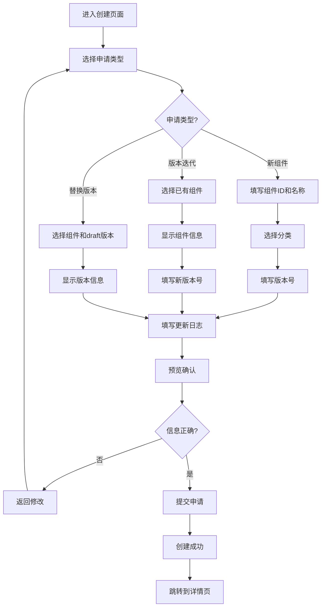
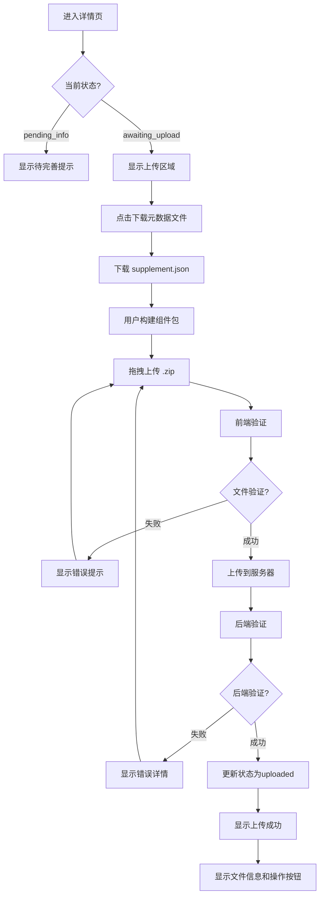
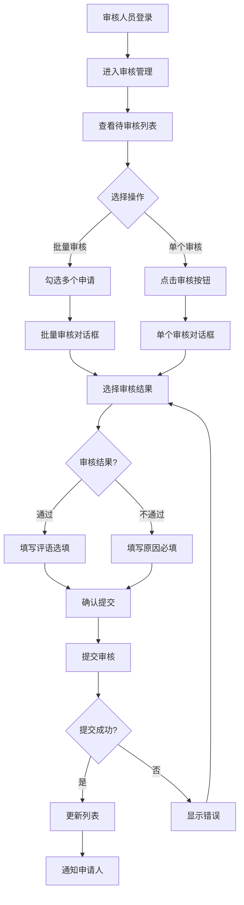

# 组件研发申请流程 - 前端设计方案

## 📋 目录

- [1. 概述](#1-概述)
- [2. 页面架构](#2-页面架构)
- [3. 页面详细设计](#3-页面详细设计)
- [4. 组件使用方案](#4-组件使用方案)
- [5. 交互流程设计](#5-交互流程设计)
- [6. 状态管理](#6-状态管理)
- [7. 技术实现要点](#7-技术实现要点)

---

## 1. 概述

### 1.1 设计目标

- 🎯 **流程可视化**：使用 `n-steps` 清晰展示申请流程进度
- 📊 **信息结构化**：使用 `n-data-table` 管理申请列表
- 🌳 **分类层级化**：使用 `n-tree` 选择组件分类
- 🎨 **界面美观化**：遵循 Naive UI 设计规范
- 🔄 **交互友好化**：操作流畅，反馈及时

### 1.2 技术栈

- **UI框架**：Naive UI
- **前端框架**：Vue 3 + TypeScript
- **状态管理**：Pinia
- **路由管理**：Vue Router
- **HTTP客户端**：Axios

### 1.3 核心组件使用

| Naive UI 组件    | 使用场景                       | 页面位置               |
| ---------------- | ------------------------------ | ---------------------- |
| `n-steps`        | 展示申请流程进度               | 申请详情页、创建申请页 |
| `n-data-table`   | 展示申请列表、审核列表         | 申请列表页、审核管理页 |
| `n-tree`         | 选择组件分类、展示分类结构     | 创建申请页、申请详情页 |
| `n-upload`       | 上传组件包                     | 申请详情页             |
| `n-card`         | 内容分组展示                   | 所有页面               |
| `n-descriptions` | 展示申请详细信息               | 申请详情页             |
| `n-timeline`     | 展示申请历史记录、审核记录     | 申请详情页             |
| `n-button`       | 操作按钮（提交、取消、审核等） | 所有页面               |
| `n-tag`          | 状态标签展示                   | 申请列表、申请详情     |
| `n-modal`        | 确认对话框、审核对话框         | 申请详情页、审核管理页 |
| `n-form`         | 申请表单、审核表单             | 创建申请页、审核对话框 |
| `n-alert`        | 操作提示、警告信息             | 申请详情页             |
| `n-spin`         | 加载状态                       | 所有页面               |

---

## 2. 页面架构

### 2.1 页面结构图

```
组件研发申请模块
├── 申请管理
│   ├── 我的申请列表页 (MyApplications.vue)
│   ├── 创建申请页 (CreateApplication.vue)
│   └── 申请详情页 (ApplicationDetail.vue)
└── 审核管理
    ├── 待审核列表页 (ReviewList.vue)
    └── 审核详情页 (ReviewDetail.vue)
```

### 2.2 路由配置

```typescript
// router/modules/development.ts
export default [
  {
    path: '/development',
    name: 'Development',
    component: Layout,
    meta: { title: '组件研发', icon: 'Code' },
    children: [
      {
        path: 'applications',
        name: 'MyApplications',
        component: () => import('@/views/development/MyApplications.vue'),
        meta: { title: '我的申请', permission: 'development:application:view' }
      },
      {
        path: 'applications/create',
        name: 'CreateApplication',
        component: () => import('@/views/development/CreateApplication.vue'),
        meta: { title: '创建申请', permission: 'development:application:create' }
      },
      {
        path: 'applications/:id',
        name: 'ApplicationDetail',
        component: () => import('@/views/development/ApplicationDetail.vue'),
        meta: { title: '申请详情', permission: 'development:application:view' }
      },
      {
        path: 'reviews',
        name: 'ReviewList',
        component: () => import('@/views/development/ReviewList.vue'),
        meta: { title: '审核管理', permission: 'development:application:review' }
      },
      {
        path: 'reviews/:id',
        name: 'ReviewDetail',
        component: () => import('@/views/development/ReviewDetail.vue'),
        meta: { title: '审核详情', permission: 'development:application:review' }
      }
    ]
  }
]
```

### 2.3 页面功能矩阵

| 页面名称           | 主要功能                                   | 使用的核心组件                    | 权限要求                         |
| ------------------ | ------------------------------------------ | --------------------------------- | -------------------------------- |
| **我的申请列表页** | 展示个人申请列表、筛选、搜索               | n-data-table, n-tag, n-button     | `development:application:view`   |
| **创建申请页**     | 创建新组件/版本迭代/替换版本申请           | n-steps, n-form, n-tree           | `development:application:create` |
| **申请详情页**     | 展示申请详情、上传文件、提交审核、查看进度 | n-steps, n-descriptions, n-upload | `development:application:view`   |
| **待审核列表页**   | 展示待审核申请列表                         | n-data-table, n-tag               | `development:application:review` |
| **审核详情页**     | 查看申请详情、执行审核操作                 | n-steps, n-descriptions, n-modal  | `development:application:review` |

---

## 3. 页面详细设计

### 3.1 我的申请列表页（MyApplications.vue）

#### 3.1.1 页面布局

```vue
<template>
  <div class="applications-page">
    <!-- 顶部操作栏 -->
    <n-card :bordered="false" class="toolbar-card">
      <n-space justify="space-between" align="center">
        <n-space>
          <!-- 筛选器 -->
          <n-select
            v-model:value="filters.status"
            :options="statusOptions"
            placeholder="状态筛选"
            clearable
            style="width: 150px"
          />
          <n-select
            v-model:value="filters.applicationType"
            :options="applicationTypeOptions"
            placeholder="申请类型"
            clearable
            style="width: 150px"
          />
          <n-input
            v-model:value="filters.keyword"
            placeholder="搜索组件名称或ID"
            clearable
            style="width: 200px"
          >
            <template #prefix>
              <n-icon :component="SearchIcon" />
            </template>
          </n-input>
          <n-button @click="handleSearch" type="primary">
            <template #icon>
              <n-icon :component="SearchIcon" />
            </template>
            搜索
          </n-button>
        </n-space>

        <!-- 创建按钮 -->
        <n-button type="primary" @click="handleCreate">
          <template #icon>
            <n-icon :component="AddIcon" />
          </template>
          创建申请
        </n-button>
      </n-space>
    </n-card>

    <!-- 数据表格 -->
    <n-card :bordered="false" class="table-card">
      <n-data-table
        :columns="columns"
        :data="applications"
        :loading="loading"
        :pagination="pagination"
        :row-key="(row) => row.id"
        @update:page="handlePageChange"
        @update:page-size="handlePageSizeChange"
        striped
        :scroll-x="1200"
      />
    </n-card>
  </div>
</template>
```

#### 3.1.2 表格列配置

```typescript
// 列定义
const columns = [
  {
    title: '申请单号',
    key: 'applicationNo',
    width: 180,
    fixed: 'left',
    render: (row) => {
      return h(
        NButton,
        {
          text: true,
          type: 'primary',
          onClick: () => router.push(`/development/applications/${row.id}`)
        },
        { default: () => row.applicationNo }
      )
    }
  },
  {
    title: '申请类型',
    key: 'applicationType',
    width: 100,
    render: (row) => {
      const typeMap = {
        new: { label: '新组件', type: 'success' },
        version: { label: '版本迭代', type: 'info' },
        replace: { label: '替换版本', type: 'warning' }
      }
      const config = typeMap[row.applicationType]
      return h(NTag, { type: config.type }, { default: () => config.label })
    }
  },
  {
    title: '组件ID',
    key: 'componentId',
    width: 150
  },
  {
    title: '组件名称',
    key: 'name',
    width: 150
  },
  {
    title: '目标版本',
    key: 'targetVersion',
    width: 100
  },
  {
    title: '状态',
    key: 'developmentStatus',
    width: 120,
    render: (row) => {
      return h(
        NTag,
        { type: getStatusType(row.developmentStatus) },
        { default: () => getStatusLabel(row.developmentStatus) }
      )
    }
  },
  {
    title: '创建时间',
    key: 'createdAt',
    width: 180,
    render: (row) => formatDateTime(row.createdAt)
  },
  {
    title: '操作',
    key: 'actions',
    width: 200,
    fixed: 'right',
    render: (row) => {
      return h(NSpace, null, {
        default: () => [
          h(
            NButton,
            {
              size: 'small',
              onClick: () => router.push(`/development/applications/${row.id}`)
            },
            { default: () => '查看详情' }
          ),
          // 根据状态显示不同操作
          canCancel(row.developmentStatus) &&
            h(
              NButton,
              {
                size: 'small',
                type: 'error',
                onClick: () => handleCancel(row)
              },
              { default: () => '取消申请' }
            )
        ]
      })
    }
  }
]
```

#### 3.1.3 状态样式映射

```typescript
// 状态映射
const statusConfig = {
  pending_info: {
    label: '待完善信息',
    type: 'default',
    color: '#999'
  },
  awaiting_upload: {
    label: '等待上传',
    type: 'info',
    color: '#2080f0'
  },
  uploaded: {
    label: '已上传',
    type: 'warning',
    color: '#f0a020'
  },
  under_review: {
    label: '审核中',
    type: 'warning',
    color: '#f0a020'
  },
  rejected: {
    label: '审核不通过',
    type: 'error',
    color: '#d03050'
  },
  approved: {
    label: '审核通过',
    type: 'success',
    color: '#18a058'
  },
  completed: {
    label: '已完成',
    type: 'success',
    color: '#18a058'
  },
  cancelled: {
    label: '已取消',
    type: 'default',
    color: '#999'
  }
}

function getStatusLabel(status: string): string {
  return statusConfig[status]?.label || status
}

function getStatusType(status: string): string {
  return statusConfig[status]?.type || 'default'
}
```

#### 3.1.4 页面效果图

```
┌─────────────────────────────────────────────────────────────────────┐
│  我的申请                                                            │
├─────────────────────────────────────────────────────────────────────┤
│  [状态筛选 ▼] [申请类型 ▼] [搜索框 🔍]  [搜索]        [+ 创建申请] │
├─────────────────────────────────────────────────────────────────────┤
│  申请单号      类型    组件ID     名称    版本   状态     时间      操作│
│  APP-001      新组件  DataTable  数据表格 1.0.0 [已上传]  2026-01-07 [查看][取消]│
│  APP-002      版本迭代 BarChart   柱状图  2.1.0 [审核中]  2026-01-07 [查看]│
│  APP-003      替换版本 LineChart  折线图  2.0.0 [审核通过] 2026-01-06 [查看]│
│                                                                      │
│  第 1 页，共 10 页                                [1] 2 3 4 5 > >>  │
└─────────────────────────────────────────────────────────────────────┘
```

---

### 3.2 创建申请页（CreateApplication.vue）

#### 3.2.1 页面布局

```vue
<template>
  <div class="create-application-page">
    <!-- 进度步骤 -->
    <n-card :bordered="false">
      <n-steps :current="currentStep" :status="stepStatus">
        <n-step title="选择申请类型" description="新组件/版本迭代/替换版本" />
        <n-step title="填写基本信息" description="组件信息和版本号" />
        <n-step title="确认提交" description="检查信息并提交" />
      </n-steps>
    </n-card>

    <!-- 步骤内容 -->
    <n-card :bordered="false" class="content-card">
      <!-- 步骤1：选择申请类型 -->
      <div v-if="currentStep === 0">
        <h3>选择申请类型</h3>
        <n-space vertical size="large">
          <n-radio-group v-model:value="formData.applicationType">
            <n-space vertical>
              <n-radio value="new">
                <n-space align="center">
                  <n-icon :component="AddIcon" size="20" color="#18a058" />
                  <div>
                    <div class="radio-title">新组件创建</div>
                    <div class="radio-desc">创建全新的组件，默认版本 1.0.0</div>
                  </div>
                </n-space>
              </n-radio>
              <n-radio value="version">
                <n-space align="center">
                  <n-icon :component="VersionIcon" size="20" color="#2080f0" />
                  <div>
                    <div class="radio-title">版本迭代</div>
                    <div class="radio-desc">为已有组件添加新版本</div>
                  </div>
                </n-space>
              </n-radio>
              <n-radio value="replace">
                <n-space align="center">
                  <n-icon :component="ReplaceIcon" size="20" color="#f0a020" />
                  <div>
                    <div class="radio-title">替换版本</div>
                    <div class="radio-desc">替换已有的 draft 状态版本</div>
                  </div>
                </n-space>
              </n-radio>
            </n-space>
          </n-radio-group>

          <n-alert v-if="formData.applicationType === 'replace'" type="warning">
            <template #icon>
              <n-icon :component="WarningIcon" />
            </template>
            仅支持替换 <n-tag size="small" type="warning">draft</n-tag> 状态的版本，
            <n-tag size="small" type="success">published</n-tag> 状态的版本不可替换
          </n-alert>
        </n-space>
      </div>

      <!-- 步骤2：填写基本信息 -->
      <div v-if="currentStep === 1">
        <h3>填写基本信息</h3>
        <n-form
          ref="formRef"
          :model="formData"
          :rules="formRules"
          label-placement="left"
          label-width="120"
        >
          <!-- 新组件表单 -->
          <template v-if="formData.applicationType === 'new'">
            <n-form-item label="组件ID" path="componentId">
              <n-input
                v-model:value="formData.componentId"
                placeholder="如：DataTable"
                @blur="checkComponentIdAvailable"
              />
            </n-form-item>
            <n-form-item label="组件名称" path="name">
              <n-input v-model:value="formData.name" placeholder="如：数据表格" />
            </n-form-item>
            <n-form-item label="组件描述" path="description">
              <n-input
                v-model:value="formData.description"
                type="textarea"
                placeholder="简要描述组件功能"
                :rows="3"
              />
            </n-form-item>
            <n-form-item label="组件分类" path="classification">
              <n-tree-select
                v-model:value="formData.classification"
                :options="categoryTree"
                key-field="id"
                label-field="name"
                children-field="children"
                placeholder="选择分类"
                clearable
                filterable
                cascade
                check-strategy="child"
              />
            </n-form-item>
            <n-form-item label="初始版本" path="targetVersion">
              <n-input v-model:value="formData.targetVersion" placeholder="默认 1.0.0" disabled />
            </n-form-item>
          </template>

          <!-- 版本迭代表单 -->
          <template v-else-if="formData.applicationType === 'version'">
            <n-form-item label="选择组件" path="componentId">
              <n-select
                v-model:value="formData.componentId"
                :options="existingComponents"
                placeholder="选择已有组件"
                filterable
                @update:value="handleComponentSelect"
              />
            </n-form-item>
            <n-form-item label="组件信息">
              <n-card v-if="selectedComponent" size="small" embedded>
                <n-descriptions :column="2" label-placement="left">
                  <n-descriptions-item label="组件名称">
                    {{ selectedComponent.name }}
                  </n-descriptions-item>
                  <n-descriptions-item label="当前最高版本">
                    <n-tag type="info">{{ selectedComponent.latestVersion }}</n-tag>
                  </n-descriptions-item>
                  <n-descriptions-item label="分类" :span="2">
                    {{ selectedComponent.classification }}
                  </n-descriptions-item>
                </n-descriptions>
              </n-card>
            </n-form-item>
            <n-form-item label="新版本号" path="targetVersion">
              <n-input
                v-model:value="formData.targetVersion"
                placeholder="如：2.1.0"
                @blur="checkVersionAvailable"
              />
              <template #feedback>
                <span class="hint">版本号必须大于当前最高版本</span>
              </template>
            </n-form-item>
          </template>

          <!-- 替换版本表单 -->
          <template v-else-if="formData.applicationType === 'replace'">
            <n-form-item label="选择组件" path="componentId">
              <n-select
                v-model:value="formData.componentId"
                :options="existingComponents"
                placeholder="选择已有组件"
                filterable
                @update:value="handleComponentSelectForReplace"
              />
            </n-form-item>
            <n-form-item label="选择版本" path="existingVersionId">
              <n-select
                v-model:value="formData.existingVersionId"
                :options="draftVersions"
                placeholder="选择要替换的版本"
                :disabled="!formData.componentId"
              />
            </n-form-item>
            <n-form-item label="版本信息">
              <n-card v-if="selectedVersion" size="small" embedded>
                <n-descriptions :column="2" label-placement="left">
                  <n-descriptions-item label="版本号">
                    <n-tag type="warning">{{ selectedVersion.version }}</n-tag>
                  </n-descriptions-item>
                  <n-descriptions-item label="状态">
                    <n-tag type="warning">draft</n-tag>
                  </n-descriptions-item>
                  <n-descriptions-item label="创建时间" :span="2">
                    {{ formatDateTime(selectedVersion.createdAt) }}
                  </n-descriptions-item>
                </n-descriptions>
              </n-card>
            </n-form-item>
          </template>

          <!-- 通用字段 -->
          <n-form-item label="更新日志" path="changelog">
            <n-input
              v-model:value="formData.changelog"
              type="textarea"
              placeholder="描述本次更新内容"
              :rows="4"
            />
          </n-form-item>
        </n-form>
      </div>

      <!-- 步骤3：确认提交 -->
      <div v-if="currentStep === 2">
        <h3>确认申请信息</h3>
        <n-card embedded>
          <n-descriptions :column="2" label-placement="left" bordered>
            <n-descriptions-item label="申请类型">
              <n-tag :type="getApplicationTypeConfig(formData.applicationType).type">
                {{ getApplicationTypeConfig(formData.applicationType).label }}
              </n-tag>
            </n-descriptions-item>
            <n-descriptions-item label="组件ID">
              {{ formData.componentId }}
            </n-descriptions-item>
            <n-descriptions-item v-if="formData.applicationType === 'new'" label="组件名称">
              {{ formData.name }}
            </n-descriptions-item>
            <n-descriptions-item label="目标版本">
              <n-tag type="info">{{ formData.targetVersion }}</n-tag>
            </n-descriptions-item>
            <n-descriptions-item v-if="formData.description" label="组件描述" :span="2">
              {{ formData.description }}
            </n-descriptions-item>
            <n-descriptions-item label="更新日志" :span="2">
              {{ formData.changelog }}
            </n-descriptions-item>
          </n-descriptions>
        </n-card>

        <n-alert type="info" style="margin-top: 16px">
          <template #icon>
            <n-icon :component="InfoIcon" />
          </template>
          提交后将创建研发申请，您可以在申请详情页下载组件元数据文件并上传组件包
        </n-alert>
      </div>
    </n-card>

    <!-- 操作按钮 -->
    <n-card :bordered="false">
      <n-space justify="space-between">
        <n-button @click="handlePrevStep" :disabled="currentStep === 0"> 上一步 </n-button>
        <n-space>
          <n-button @click="handleCancel">取消</n-button>
          <n-button v-if="currentStep < 2" type="primary" @click="handleNextStep">
            下一步
          </n-button>
          <n-button v-else type="primary" @click="handleSubmit" :loading="submitting">
            提交申请
          </n-button>
        </n-space>
      </n-space>
    </n-card>
  </div>
</template>
```

#### 3.2.2 分类树选择器

```typescript
// 分类树数据结构
interface CategoryTreeNode {
  id: string
  name: string
  children?: CategoryTreeNode[]
}

// 从API获取分类树
const categoryTree = ref<CategoryTreeNode[]>([])

async function loadCategoryTree() {
  const response = await api.get('/api/component-categories/tree')
  categoryTree.value = transformCategoryTree(response.data)
}

// 转换分类树数据
function transformCategoryTree(data: any[]): CategoryTreeNode[] {
  return data.map((item) => ({
    id: item.code,
    name: item.name,
    children: item.children ? transformCategoryTree(item.children) : undefined
  }))
}
```

#### 3.2.3 表单验证规则

```typescript
const formRules = {
  applicationType: {
    required: true,
    message: '请选择申请类型',
    trigger: 'change'
  },
  componentId: [
    {
      required: true,
      message: '请输入组件ID',
      trigger: 'blur'
    },
    {
      pattern: /^[A-Z][a-zA-Z0-9]*$/,
      message: '组件ID必须以大写字母开头，只能包含字母和数字',
      trigger: 'blur'
    },
    {
      asyncValidator: async (rule, value) => {
        if (formData.applicationType === 'new') {
          const available = await checkComponentIdAvailable(value)
          if (!available) {
            throw new Error('组件ID已存在')
          }
        }
      },
      trigger: 'blur'
    }
  ],
  name: {
    required: true,
    message: '请输入组件名称',
    trigger: 'blur'
  },
  classification: {
    required: true,
    message: '请选择组件分类',
    trigger: 'change'
  },
  targetVersion: [
    {
      required: true,
      message: '请输入版本号',
      trigger: 'blur'
    },
    {
      pattern: /^\d+\.\d+\.\d+$/,
      message: '版本号格式错误，应为 x.y.z',
      trigger: 'blur'
    },
    {
      asyncValidator: async (rule, value) => {
        if (formData.applicationType === 'version') {
          const valid = await checkVersionAvailable(formData.componentId, value)
          if (!valid) {
            throw new Error('版本号已存在或不符合递增规则')
          }
        }
      },
      trigger: 'blur'
    }
  ],
  changelog: {
    required: true,
    message: '请填写更新日志',
    trigger: 'blur'
  }
}
```

#### 3.2.4 页面效果图

```
┌─────────────────────────────────────────────────────────────────────┐
│  创建研发申请                                                        │
├─────────────────────────────────────────────────────────────────────┤
│  ① 选择申请类型 ━━━━ ② 填写基本信息 ━━━━ ③ 确认提交               │
│  ────────────────                                                   │
├─────────────────────────────────────────────────────────────────────┤
│  选择申请类型                                                        │
│                                                                      │
│  ○ ✓ 新组件创建                                                     │
│       创建全新的组件，默认版本 1.0.0                                │
│                                                                      │
│  ○ ↻ 版本迭代                                                       │
│       为已有组件添加新版本                                          │
│                                                                      │
│  ○ ⟳ 替换版本                                                       │
│       替换已有的 draft 状态版本                                     │
│                                                                      │
├─────────────────────────────────────────────────────────────────────┤
│  [上一步]                                           [取消] [下一步]  │
└─────────────────────────────────────────────────────────────────────┘
```

---

### 3.3 申请详情页（ApplicationDetail.vue）

#### 3.3.1 页面布局

```vue
<template>
  <div class="application-detail-page">
    <!-- 顶部信息卡片 -->
    <n-card :bordered="false" class="header-card">
      <n-space justify="space-between" align="center">
        <n-space align="center" size="large">
          <n-button text @click="router.back()">
            <template #icon>
              <n-icon :component="ArrowLeftIcon" />
            </template>
          </n-button>
          <div>
            <h2 style="margin: 0">{{ application.applicationNo }}</h2>
            <n-text depth="3">{{ application.componentId }} - {{ application.name }}</n-text>
          </div>
        </n-space>
        <n-space>
          <n-tag :type="getStatusType(application.developmentStatus)" size="large">
            {{ getStatusLabel(application.developmentStatus) }}
          </n-tag>
          <!-- 操作按钮组 -->
          <n-dropdown :options="actionOptions" @select="handleAction">
            <n-button>
              操作
              <template #icon>
                <n-icon :component="DownIcon" />
              </template>
            </n-button>
          </n-dropdown>
        </n-space>
      </n-space>
    </n-card>

    <!-- 流程进度 -->
    <n-card :bordered="false" title="流程进度">
      <n-steps :current="currentStepIndex" :status="stepStatus" size="small">
        <n-step title="创建申请" :description="getStepDescription('pending_info')">
          <template #icon>
            <n-icon :component="FileAddIcon" />
          </template>
        </n-step>
        <n-step title="完善信息" :description="getStepDescription('awaiting_upload')">
          <template #icon>
            <n-icon :component="FormIcon" />
          </template>
        </n-step>
        <n-step title="上传组件包" :description="getStepDescription('uploaded')">
          <template #icon>
            <n-icon :component="UploadIcon" />
          </template>
        </n-step>
        <n-step title="提交审核" :description="getStepDescription('under_review')">
          <template #icon>
            <n-icon :component="SendIcon" />
          </template>
        </n-step>
        <n-step title="审核完成" :description="getStepDescription('approved')">
          <template #icon>
            <n-icon :component="CheckIcon" />
          </template>
        </n-step>
        <n-step title="研发完成" :description="getStepDescription('completed')">
          <template #icon>
            <n-icon :component="SuccessIcon" />
          </template>
        </n-step>
      </n-steps>

      <!-- 异常状态提示 -->
      <n-alert
        v-if="application.developmentStatus === 'rejected'"
        type="error"
        style="margin-top: 16px"
      >
        <template #icon>
          <n-icon :component="ErrorIcon" />
        </template>
        <template #header>审核不通过</template>
        {{ application.reviewInfo?.reviewComment }}
      </n-alert>

      <n-alert
        v-else-if="application.developmentStatus === 'cancelled'"
        type="warning"
        style="margin-top: 16px"
      >
        <template #icon>
          <n-icon :component="WarningIcon" />
        </template>
        <template #header>申请已取消</template>
        该申请已被取消，版本号已释放
      </n-alert>
    </n-card>

    <!-- 详细信息 -->
    <n-grid :cols="2" :x-gap="16">
      <!-- 左列：基本信息 -->
      <n-gi>
        <n-card :bordered="false" title="基本信息">
          <n-descriptions :column="1" label-placement="left">
            <n-descriptions-item label="申请单号">
              {{ application.applicationNo }}
            </n-descriptions-item>
            <n-descriptions-item label="申请类型">
              <n-tag :type="getApplicationTypeConfig(application.applicationType).type">
                {{ getApplicationTypeConfig(application.applicationType).label }}
              </n-tag>
            </n-descriptions-item>
            <n-descriptions-item label="组件ID">
              {{ application.componentId }}
            </n-descriptions-item>
            <n-descriptions-item label="组件名称">
              {{ application.name }}
            </n-descriptions-item>
            <n-descriptions-item label="目标版本">
              <n-tag type="info">{{ application.targetVersion }}</n-tag>
            </n-descriptions-item>
            <n-descriptions-item v-if="application.classification" label="组件分类">
              {{ application.classificationLevel1 }} / {{ application.classificationLevel2 }}
            </n-descriptions-item>
            <n-descriptions-item v-if="application.description" label="组件描述">
              {{ application.description }}
            </n-descriptions-item>
            <n-descriptions-item label="更新日志">
              <n-text>{{ application.changelog }}</n-text>
            </n-descriptions-item>
            <n-descriptions-item label="申请人">
              {{ application.applicant?.username }}
            </n-descriptions-item>
            <n-descriptions-item label="创建时间">
              {{ formatDateTime(application.createdAt) }}
            </n-descriptions-item>
          </n-descriptions>
        </n-card>
      </n-gi>

      <!-- 右列：操作指南 -->
      <n-gi>
        <n-card :bordered="false" title="操作指南">
          <!-- 待完善信息状态 -->
          <template v-if="application.developmentStatus === 'pending_info'">
            <n-alert type="info">
              <template #header>下一步：完善申请信息</template>
              请确认申请信息完整后，系统将自动进入"等待上传"状态
            </n-alert>
          </template>

          <!-- 等待上传状态 -->
          <template v-else-if="application.developmentStatus === 'awaiting_upload'">
            <n-space vertical size="large">
              <n-alert type="info">
                <template #header>下一步：下载元数据文件并上传组件包</template>
              </n-alert>

              <n-card size="small" embedded title="操作步骤">
                <n-ol style="padding-left: 20px">
                  <n-li>点击下方按钮下载 <n-text code>component.meta.supplement.json</n-text></n-li>
                  <n-li>将文件放入组件包根目录</n-li>
                  <n-li
                    >使用 <n-text code>abd-cli</n-text> 构建组件（自动生成
                    component.meta.json）</n-li
                  >
                  <n-li>打包 .zip 文件（必须包含两个 meta 文件）</n-li>
                  <n-li>上传组件包</n-li>
                </n-ol>
              </n-card>

              <n-button type="primary" block @click="handleExportMeta">
                <template #icon>
                  <n-icon :component="DownloadIcon" />
                </template>
                下载元数据文件
              </n-button>

              <n-divider />

              <n-upload
                :action="`/api/development-applications/${application.id}/upload`"
                :headers="{ Authorization: `Bearer ${token}` }"
                :max="1"
                accept=".zip"
                @finish="handleUploadFinish"
                @error="handleUploadError"
              >
                <n-upload-dragger>
                  <div style="margin-bottom: 12px">
                    <n-icon size="48" :depth="3">
                      <UploadIcon />
                    </n-icon>
                  </div>
                  <n-text style="font-size: 16px"> 点击或拖拽文件到此区域上传 </n-text>
                  <n-p depth="3" style="margin: 8px 0 0 0">
                    仅支持 .zip 格式，文件大小不超过 50MB
                  </n-p>
                </n-upload-dragger>
              </n-upload>
            </n-space>
          </template>

          <!-- 已上传状态 -->
          <template v-else-if="application.developmentStatus === 'uploaded'">
            <n-space vertical size="large">
              <n-alert type="success">
                <template #header>组件包已上传</template>
                文件名：{{ application.uploadInfo?.fileName }}
              </n-alert>

              <n-card size="small" embedded title="上传文件信息">
                <n-descriptions :column="1" label-placement="left" size="small">
                  <n-descriptions-item label="文件名">
                    {{ application.uploadInfo?.fileName }}
                  </n-descriptions-item>
                  <n-descriptions-item label="文件大小">
                    {{ formatFileSize(application.uploadInfo?.fileSize) }}
                  </n-descriptions-item>
                  <n-descriptions-item label="上传时间">
                    {{ formatDateTime(application.uploadInfo?.uploadTime) }}
                  </n-descriptions-item>
                  <n-descriptions-item label="校验状态">
                    <n-tag type="success">验证通过</n-tag>
                  </n-descriptions-item>
                </n-descriptions>
              </n-card>

              <n-space>
                <n-button type="error" @click="handleDeleteUpload">
                  <template #icon>
                    <n-icon :component="DeleteIcon" />
                  </template>
                  删除上传包
                </n-button>
                <n-button type="primary" @click="handleSubmitReview">
                  <template #icon>
                    <n-icon :component="SendIcon" />
                  </template>
                  提交审核
                </n-button>
              </n-space>
            </n-space>
          </template>

          <!-- 审核中状态 -->
          <template v-else-if="application.developmentStatus === 'under_review'">
            <n-alert type="warning">
              <template #header>审核中</template>
              申请已提交审核，请等待审核人员处理
            </n-alert>
            <n-card size="small" embedded title="审核信息" style="margin-top: 16px">
              <n-descriptions :column="1" label-placement="left" size="small">
                <n-descriptions-item label="提交时间">
                  {{ formatDateTime(application.submittedAt) }}
                </n-descriptions-item>
              </n-descriptions>
            </n-card>
          </template>

          <!-- 审核不通过状态 -->
          <template v-else-if="application.developmentStatus === 'rejected'">
            <n-space vertical size="large">
              <n-alert type="error">
                <template #header>审核不通过</template>
              </n-alert>

              <n-card size="small" embedded title="审核意见">
                <n-descriptions :column="1" label-placement="left" size="small">
                  <n-descriptions-item label="审核人">
                    {{ application.reviewInfo?.reviewerName }}
                  </n-descriptions-item>
                  <n-descriptions-item label="审核时间">
                    {{ formatDateTime(application.reviewInfo?.reviewTime) }}
                  </n-descriptions-item>
                  <n-descriptions-item label="不通过原因">
                    <n-text type="error">{{ application.reviewInfo?.reviewComment }}</n-text>
                  </n-descriptions-item>
                </n-descriptions>
              </n-card>

              <n-alert type="info">
                <template #header>下一步</template>
                请根据审核意见修改组件包后重新上传
              </n-alert>
            </n-space>
          </template>

          <!-- 审核通过状态 -->
          <template v-else-if="application.developmentStatus === 'approved'">
            <n-space vertical size="large">
              <n-alert type="success">
                <template #header>审核通过</template>
              </n-alert>

              <n-card size="small" embedded title="审核信息">
                <n-descriptions :column="1" label-placement="left" size="small">
                  <n-descriptions-item label="审核人">
                    {{ application.reviewInfo?.reviewerName }}
                  </n-descriptions-item>
                  <n-descriptions-item label="审核时间">
                    {{ formatDateTime(application.reviewInfo?.reviewTime) }}
                  </n-descriptions-item>
                  <n-descriptions-item label="审核意见">
                    {{ application.reviewInfo?.reviewComment }}
                  </n-descriptions-item>
                </n-descriptions>
              </n-card>

              <n-alert type="info">
                <template #header>下一步</template>
                版本已创建为 draft 状态，您可以前往版本管理发布该版本
              </n-alert>

              <n-button type="primary" @click="handleGoToVersion"> 查看版本详情 </n-button>
            </n-space>
          </template>

          <!-- 已完成状态 -->
          <template v-else-if="application.developmentStatus === 'completed'">
            <n-result status="success" title="研发完成" description="版本已发布">
              <template #footer>
                <n-button type="primary" @click="handleGoToVersion"> 查看版本详情 </n-button>
              </template>
            </n-result>
          </template>

          <!-- 已取消状态 -->
          <template v-else-if="application.developmentStatus === 'cancelled'">
            <n-result status="info" title="申请已取消" description="版本号已释放，可重新申请">
            </n-result>
          </template>
        </n-card>
      </n-gi>
    </n-grid>

    <!-- 操作历史 -->
    <n-card :bordered="false" title="操作历史">
      <n-timeline>
        <n-timeline-item
          v-for="(record, index) in historyRecords"
          :key="index"
          :type="record.type"
          :title="record.title"
          :content="record.content"
          :time="formatDateTime(record.time)"
        >
          <template #icon>
            <n-icon :component="record.icon" />
          </template>
        </n-timeline-item>
      </n-timeline>
    </n-card>
  </div>
</template>
```

#### 3.3.2 进度步骤计算

```typescript
// 根据状态计算当前步骤
function getCurrentStepIndex(status: string): number {
  const stepMap = {
    pending_info: 0,
    awaiting_upload: 1,
    uploaded: 2,
    under_review: 3,
    rejected: 3, // 停留在审核步骤
    approved: 4,
    completed: 5,
    cancelled: -1 // 特殊状态
  }
  return stepMap[status] ?? 0
}

// 计算步骤状态
function getStepStatus(status: string): 'process' | 'finish' | 'error' | 'wait' {
  if (status === 'rejected') return 'error'
  if (status === 'cancelled') return 'error'
  return 'process'
}

// 获取步骤描述
function getStepDescription(targetStatus: string): string {
  const currentStatus = application.value.developmentStatus
  const descriptions = {
    pending_info: application.value.createdAt ? formatDateTime(application.value.createdAt) : '',
    awaiting_upload: '准备上传组件包',
    uploaded: application.value.uploadInfo?.uploadTime
      ? formatDateTime(application.value.uploadInfo.uploadTime)
      : '',
    under_review: application.value.submittedAt
      ? formatDateTime(application.value.submittedAt)
      : '',
    approved: application.value.reviewedAt ? formatDateTime(application.value.reviewedAt) : '',
    completed: application.value.completedAt ? formatDateTime(application.value.completedAt) : ''
  }
  return descriptions[targetStatus] || ''
}
```

#### 3.3.3 操作历史时间线

```typescript
// 构建操作历史记录
function buildHistoryRecords() {
  const records = []

  // 创建申请
  records.push({
    type: 'success',
    icon: FileAddIcon,
    title: '创建申请',
    content: `${application.value.applicant?.username} 创建了研发申请`,
    time: application.value.createdAt
  })

  // 上传文件
  if (application.value.uploadInfo?.uploadTime) {
    records.push({
      type: 'info',
      icon: UploadIcon,
      title: '上传组件包',
      content: `上传文件：${application.value.uploadInfo.fileName}`,
      time: application.value.uploadInfo.uploadTime
    })
  }

  // 提交审核
  if (application.value.submittedAt) {
    records.push({
      type: 'warning',
      icon: SendIcon,
      title: '提交审核',
      content: '申请已提交审核',
      time: application.value.submittedAt
    })
  }

  // 审核结果
  if (application.value.reviewInfo?.reviewTime) {
    const isApproved = application.value.reviewInfo.reviewAction === 'approve'
    records.push({
      type: isApproved ? 'success' : 'error',
      icon: isApproved ? CheckIcon : CloseIcon,
      title: isApproved ? '审核通过' : '审核不通过',
      content: `${application.value.reviewInfo.reviewerName}：${application.value.reviewInfo.reviewComment}`,
      time: application.value.reviewInfo.reviewTime
    })
  }

  // 版本发布
  if (application.value.completedAt) {
    records.push({
      type: 'success',
      icon: SuccessIcon,
      title: '研发完成',
      content: '版本已发布',
      time: application.value.completedAt
    })
  }

  // 取消申请
  if (application.value.developmentStatus === 'cancelled') {
    records.push({
      type: 'default',
      icon: CloseIcon,
      title: '取消申请',
      content: '申请已取消，版本号已释放',
      time: application.value.updatedAt
    })
  }

  return records.reverse() // 最新的在前
}
```

#### 3.3.4 页面效果图

```
┌─────────────────────────────────────────────────────────────────────┐
│  ← APP-20260107-0001                                    [已上传]  [操作▼]│
│    DataTable - 数据表格                                              │
├─────────────────────────────────────────────────────────────────────┤
│  流程进度                                                            │
│  ● ━━━━ ● ━━━━ ● ━━━━ ○ ━━━━ ○ ━━━━ ○                          │
│  创建   完善   上传   审核   通过   完成                            │
├─────────────────────────────────────────────────────────────────────┤
│  基本信息              │  操作指南                                   │
│  ─────────────────────┼─────────────────────────────               │
│  申请单号 APP-001      │  ✓ 组件包已上传                            │
│  申请类型 [新组件]     │  文件名：DataTable-1.0.0.zip               │
│  组件ID  DataTable     │                                            │
│  名称    数据表格      │  上传文件信息                              │
│  版本    1.0.0         │  文件名：DataTable-1.0.0.zip               │
│  分类    表格/数据表格 │  大小：2.34 MB                             │
│  申请人  zhangsan      │  时间：2026-01-07 11:00                    │
│  创建    2026-01-07    │  状态：[验证通过]                          │
│                        │                                            │
│                        │  [删除上传包]  [提交审核]                  │
├─────────────────────────────────────────────────────────────────────┤
│  操作历史                                                            │
│  ○ 上传组件包          2026-01-07 11:00                            │
│    上传文件：DataTable-1.0.0.zip                                    │
│  ○ 创建申请            2026-01-07 10:30                            │
│    zhangsan 创建了研发申请                                          │
└─────────────────────────────────────────────────────────────────────┘
```

---

### 3.4 审核管理页（ReviewList.vue）

#### 3.4.1 页面布局

```vue
<template>
  <div class="review-list-page">
    <!-- 顶部筛选栏 -->
    <n-card :bordered="false" class="toolbar-card">
      <n-space>
        <n-select
          v-model:value="filters.status"
          :options="reviewStatusOptions"
          placeholder="状态筛选"
          clearable
          style="width: 150px"
        />
        <n-date-picker
          v-model:value="filters.dateRange"
          type="daterange"
          clearable
          placeholder="提交时间"
        />
        <n-input
          v-model:value="filters.keyword"
          placeholder="搜索申请单号或组件"
          clearable
          style="width: 200px"
        >
          <template #prefix>
            <n-icon :component="SearchIcon" />
          </template>
        </n-input>
        <n-button @click="handleSearch" type="primary">
          <template #icon>
            <n-icon :component="SearchIcon" />
          </template>
          搜索
        </n-button>
      </n-space>
    </n-card>

    <!-- 统计卡片 -->
    <n-grid :cols="4" :x-gap="16">
      <n-gi>
        <n-card :bordered="false">
          <n-statistic label="待审核" :value="statistics.pending">
            <template #prefix>
              <n-icon :component="ClockIcon" color="#f0a020" />
            </template>
          </n-statistic>
        </n-card>
      </n-gi>
      <n-gi>
        <n-card :bordered="false">
          <n-statistic label="今日审核" :value="statistics.today">
            <template #prefix>
              <n-icon :component="CalendarIcon" color="#2080f0" />
            </template>
          </n-statistic>
        </n-card>
      </n-gi>
      <n-gi>
        <n-card :bordered="false">
          <n-statistic label="通过率" :value="statistics.approvalRate" suffix="%">
            <template #prefix>
              <n-icon :component="ChartIcon" color="#18a058" />
            </template>
          </n-statistic>
        </n-card>
      </n-gi>
      <n-gi>
        <n-card :bordered="false">
          <n-statistic label="平均耗时" :value="statistics.avgDuration" suffix="小时">
            <template #prefix>
              <n-icon :component="TimeIcon" color="#9333ea" />
            </template>
          </n-statistic>
        </n-card>
      </n-gi>
    </n-grid>

    <!-- 审核列表 -->
    <n-card :bordered="false" class="table-card">
      <n-tabs v-model:value="activeTab" type="line" animated>
        <n-tab-pane name="pending" tab="待审核">
          <n-data-table
            :columns="columns"
            :data="pendingList"
            :loading="loading"
            :pagination="pagination"
            @update:page="handlePageChange"
          />
        </n-tab-pane>
        <n-tab-pane name="reviewed" tab="已审核">
          <n-data-table
            :columns="reviewedColumns"
            :data="reviewedList"
            :loading="loading"
            :pagination="pagination"
            @update:page="handlePageChange"
          />
        </n-tab-pane>
      </n-tabs>
    </n-card>

    <!-- 审核对话框 -->
    <n-modal v-model:show="reviewModalVisible" preset="card" title="审核申请" style="width: 600px">
      <n-form
        ref="reviewFormRef"
        :model="reviewForm"
        :rules="reviewFormRules"
        label-placement="left"
        label-width="100"
      >
        <n-form-item label="申请单号">
          <n-text strong>{{ currentApplication?.applicationNo }}</n-text>
        </n-form-item>
        <n-form-item label="组件信息">
          <n-space>
            <n-tag>{{ currentApplication?.componentId }}</n-tag>
            <n-tag type="info">{{ currentApplication?.targetVersion }}</n-tag>
          </n-space>
        </n-form-item>
        <n-form-item label="审核结果" path="reviewAction">
          <n-radio-group v-model:value="reviewForm.reviewAction">
            <n-space>
              <n-radio value="approve">
                <n-space align="center">
                  <n-icon :component="CheckIcon" color="#18a058" />
                  <span>通过</span>
                </n-space>
              </n-radio>
              <n-radio value="reject">
                <n-space align="center">
                  <n-icon :component="CloseIcon" color="#d03050" />
                  <span>不通过</span>
                </n-space>
              </n-radio>
            </n-space>
          </n-radio-group>
        </n-form-item>
        <n-form-item label="审核意见" path="reviewComment">
          <n-input
            v-model:value="reviewForm.reviewComment"
            type="textarea"
            :placeholder="
              reviewForm.reviewAction === 'approve'
                ? '审核通过的评语（选填）'
                : '请填写不通过的原因'
            "
            :rows="4"
          />
        </n-form-item>
      </n-form>
      <template #footer>
        <n-space justify="end">
          <n-button @click="reviewModalVisible = false">取消</n-button>
          <n-button type="primary" @click="handleSubmitReview" :loading="submitting">
            提交审核
          </n-button>
        </n-space>
      </template>
    </n-modal>
  </div>
</template>
```

#### 3.4.2 表格列配置

```typescript
// 待审核列表列定义
const columns = [
  {
    title: '申请单号',
    key: 'applicationNo',
    width: 180,
    render: (row) => {
      return h(
        NButton,
        {
          text: true,
          type: 'primary',
          onClick: () => handleViewDetail(row)
        },
        { default: () => row.applicationNo }
      )
    }
  },
  {
    title: '申请类型',
    key: 'applicationType',
    width: 100,
    render: (row) => {
      const config = getApplicationTypeConfig(row.applicationType)
      return h(NTag, { type: config.type }, { default: () => config.label })
    }
  },
  {
    title: '组件ID',
    key: 'componentId',
    width: 150
  },
  {
    title: '组件名称',
    key: 'name',
    width: 150
  },
  {
    title: '目标版本',
    key: 'targetVersion',
    width: 100,
    render: (row) => {
      return h(NTag, { type: 'info' }, { default: () => row.targetVersion })
    }
  },
  {
    title: '申请人',
    key: 'applicant',
    width: 120,
    render: (row) => row.applicant?.username
  },
  {
    title: '提交时间',
    key: 'submittedAt',
    width: 180,
    render: (row) => formatDateTime(row.submittedAt)
  },
  {
    title: '等待时长',
    key: 'waitingDuration',
    width: 100,
    render: (row) => {
      const duration = calculateDuration(row.submittedAt)
      return h(
        NText,
        { type: duration > 24 ? 'error' : 'default' },
        { default: () => `${duration}小时` }
      )
    }
  },
  {
    title: '操作',
    key: 'actions',
    width: 200,
    fixed: 'right',
    render: (row) => {
      return h(NSpace, null, {
        default: () => [
          h(
            NButton,
            {
              size: 'small',
              onClick: () => handleViewDetail(row)
            },
            { default: () => '查看详情' }
          ),
          h(
            NButton,
            {
              size: 'small',
              type: 'primary',
              onClick: () => handleReview(row)
            },
            { default: () => '审核' }
          )
        ]
      })
    }
  }
]

// 已审核列表列定义（增加审核结果列）
const reviewedColumns = [
  ...columns.slice(0, -2), // 复用前面的列
  {
    title: '审核结果',
    key: 'reviewAction',
    width: 100,
    render: (row) => {
      const isApproved = row.reviewInfo?.reviewAction === 'approve'
      return h(
        NTag,
        { type: isApproved ? 'success' : 'error' },
        { default: () => (isApproved ? '通过' : '不通过') }
      )
    }
  },
  {
    title: '审核时间',
    key: 'reviewedAt',
    width: 180,
    render: (row) => formatDateTime(row.reviewedAt)
  },
  {
    title: '审核人',
    key: 'reviewer',
    width: 120,
    render: (row) => row.reviewer?.username
  },
  {
    title: '操作',
    key: 'actions',
    width: 120,
    fixed: 'right',
    render: (row) => {
      return h(
        NButton,
        {
          size: 'small',
          onClick: () => handleViewDetail(row)
        },
        { default: () => '查看详情' }
      )
    }
  }
]
```

#### 3.4.3 页面效果图

```
┌─────────────────────────────────────────────────────────────────────┐
│  审核管理                                                            │
├─────────────────────────────────────────────────────────────────────┤
│  [状态筛选 ▼] [提交时间 📅] [搜索框 🔍]  [搜索]                     │
├─────────────────────────────────────────────────────────────────────┤
│  ┌─────────┐ ┌─────────┐ ┌─────────┐ ┌─────────┐                  │
│  │  🕐 5   │ │  📅 12  │ │  📊 85% │ │  ⏱ 3.2 │                  │
│  │ 待审核  │ │今日审核 │ │ 通过率  │ │平均耗时 │                  │
│  └─────────┘ └─────────┘ └─────────┘ └─────────┘                  │
├─────────────────────────────────────────────────────────────────────┤
│  [待审核] [已审核]                                                  │
│  ─────────────────────────────────────────────────────────────────  │
│  申请单号     类型   组件     版本  申请人  提交时间    等待  操作  │
│  APP-001     新组件 DataTable 1.0.0 zhang  01-07 12:00 2小时 [详情][审核]│
│  APP-002     版本   BarChart  2.1.0 li     01-07 11:30 3小时 [详情][审核]│
│  APP-003     替换   LineChart 2.0.0 wang   01-06 15:00 21小时[详情][审核]│
└─────────────────────────────────────────────────────────────────────┘

┌─────────────────────────────────────────────────────────────────────┐
│  审核申请                                                    [ X ]  │
├─────────────────────────────────────────────────────────────────────┤
│  申请单号：  APP-20260107-0001                                      │
│  组件信息：  [DataTable]  [1.0.0]                                   │
│                                                                      │
│  审核结果：  ○ ✓ 通过    ○ ✗ 不通过                                │
│                                                                      │
│  审核意见：  ┌────────────────────────────────────────┐            │
│             │                                        │            │
│             │                                        │            │
│             │                                        │            │
│             └────────────────────────────────────────┘            │
│                                                                      │
│                                              [取消]  [提交审核]     │
└─────────────────────────────────────────────────────────────────────┘
```

---

## 4. 组件使用方案

### 4.1 n-steps 步骤条

#### 4.1.1 在创建申请页使用

**场景**：引导用户完成三步创建流程

```vue
<n-steps :current="currentStep" :status="stepStatus">
  <n-step title="选择申请类型" description="新组件/版本迭代/替换版本" />
  <n-step title="填写基本信息" description="组件信息和版本号" />
  <n-step title="确认提交" description="检查信息并提交" />
</n-steps>
```

**状态控制**：

```typescript
const currentStep = ref(0) // 0, 1, 2
const stepStatus = ref<'process' | 'finish' | 'error' | 'wait'>('process')

// 下一步
function handleNextStep() {
  if (currentStep.value < 2) {
    currentStep.value++
  }
}

// 上一步
function handlePrevStep() {
  if (currentStep.value > 0) {
    currentStep.value--
  }
}
```

#### 4.1.2 在申请详情页使用

**场景**：展示申请流程进度，支持动态状态

```vue
<n-steps :current="currentStepIndex" :status="stepStatus" size="small">
  <n-step title="创建申请">
    <template #icon>
      <n-icon :component="FileAddIcon" />
    </template>
  </n-step>
  <n-step title="完善信息">
    <template #icon>
      <n-icon :component="FormIcon" />
    </template>
  </n-step>
  <n-step title="上传组件包">
    <template #icon>
      <n-icon :component="UploadIcon" />
    </template>
  </n-step>
  <n-step title="提交审核">
    <template #icon>
      <n-icon :component="SendIcon" />
    </template>
  </n-step>
  <n-step title="审核完成">
    <template #icon>
      <n-icon :component="CheckIcon" />
    </template>
  </n-step>
  <n-step title="研发完成">
    <template #icon>
      <n-icon :component="SuccessIcon" />
    </template>
  </n-step>
</n-steps>
```

**动态计算当前步骤**：

```typescript
const currentStepIndex = computed(() => {
  const statusStepMap = {
    pending_info: 0,
    awaiting_upload: 1,
    uploaded: 2,
    under_review: 3,
    rejected: 3, // 停在审核步骤，但显示错误状态
    approved: 4,
    completed: 5,
    cancelled: -1
  }
  return statusStepMap[application.value.developmentStatus] ?? 0
})

const stepStatus = computed(() => {
  if (['rejected', 'cancelled'].includes(application.value.developmentStatus)) {
    return 'error'
  }
  return 'process'
})
```

---

### 4.2 n-data-table 数据表格

#### 4.2.1 基础使用

```vue
<n-data-table
  :columns="columns"
  :data="applications"
  :loading="loading"
  :pagination="pagination"
  :row-key="(row) => row.id"
  @update:page="handlePageChange"
  @update:page-size="handlePageSizeChange"
  striped
  :scroll-x="1200"
/>
```

#### 4.2.2 自定义列渲染

```typescript
// 状态列 - 使用 n-tag
{
  title: '状态',
  key: 'developmentStatus',
  width: 120,
  render: (row) => {
    return h(
      NTag,
      { type: getStatusType(row.developmentStatus) },
      { default: () => getStatusLabel(row.developmentStatus) }
    )
  }
}

// 操作列 - 使用 n-space + n-button
{
  title: '操作',
  key: 'actions',
  width: 200,
  fixed: 'right',
  render: (row) => {
    return h(NSpace, null, {
      default: () => [
        h(
          NButton,
          {
            size: 'small',
            onClick: () => handleView(row)
          },
          { default: () => '查看' }
        ),
        h(
          NButton,
          {
            size: 'small',
            type: 'primary',
            onClick: () => handleReview(row)
          },
          { default: () => '审核' }
        )
      ]
    })
  }
}
```

#### 4.2.3 可展开行

```typescript
// 用于展示详细信息
const columns = [
  {
    type: 'expand',
    expandable: (row) => row.description || row.changelog,
    renderExpand: (row) => {
      return h(
        NCard,
        { embedded: true },
        {
          default: () =>
            h(
              NDescriptions,
              {
                column: 1,
                labelPlacement: 'left'
              },
              {
                default: () => [
                  h(
                    NDescriptionsItem,
                    { label: '组件描述' },
                    {
                      default: () => row.description || '-'
                    }
                  ),
                  h(
                    NDescriptionsItem,
                    { label: '更新日志' },
                    {
                      default: () => row.changelog || '-'
                    }
                  )
                ]
              }
            )
        }
      )
    }
  }
  // ... 其他列
]
```

---

### 4.3 n-tree / n-tree-select 树选择器

#### 4.3.1 在创建申请页选择分类

```vue
<n-form-item label="组件分类" path="classification">
  <n-tree-select
    v-model:value="formData.classification"
    :options="categoryTree"
    key-field="code"
    label-field="name"
    children-field="children"
    placeholder="选择分类"
    clearable
    filterable
    cascade
    check-strategy="child"
  />
</n-form-item>
```

**数据结构**：

```typescript
interface CategoryTreeNode {
  code: string // 分类代码
  name: string // 分类名称
  children?: CategoryTreeNode[]
}

const categoryTree = ref<CategoryTreeNode[]>([
  {
    code: 'table',
    name: '表格',
    children: [
      { code: 'data-grid', name: '数据表格' },
      { code: 'tree-table', name: '树形表格' }
    ]
  },
  {
    code: 'chart',
    name: '图表',
    children: [
      { code: 'bar', name: '柱状图' },
      { code: 'line', name: '折线图' }
    ]
  }
])
```

#### 4.3.2 展示分类结构（只读）

```vue
<n-tree
  :data="categoryTree"
  key-field="code"
  label-field="name"
  children-field="children"
  :selectable="false"
  :show-line="true"
  default-expand-all
/>
```

---

### 4.4 n-upload 文件上传

#### 4.4.1 拖拽上传

```vue
<n-upload
  :action="`/api/development-applications/${applicationId}/upload`"
  :headers="{ Authorization: `Bearer ${token}` }"
  :max="1"
  accept=".zip"
  @finish="handleUploadFinish"
  @error="handleUploadError"
  @before-upload="handleBeforeUpload"
>
  <n-upload-dragger>
    <div style="margin-bottom: 12px">
      <n-icon size="48" :depth="3">
        <UploadIcon />
      </n-icon>
    </div>
    <n-text style="font-size: 16px">
      点击或拖拽文件到此区域上传
    </n-text>
    <n-p depth="3" style="margin: 8px 0 0 0">
      仅支持 .zip 格式，文件大小不超过 50MB
    </n-p>
  </n-upload-dragger>
</n-upload>
```

#### 4.4.2 上传事件处理

```typescript
// 上传前验证
function handleBeforeUpload(options: { file: UploadFileInfo }) {
  const file = options.file.file

  // 验证文件类型
  if (!file?.name.endsWith('.zip')) {
    message.error('仅支持 .zip 格式')
    return false
  }

  // 验证文件大小（50MB）
  if (file.size && file.size > 50 * 1024 * 1024) {
    message.error('文件大小不能超过 50MB')
    return false
  }

  return true
}

// 上传成功
function handleUploadFinish({ event }: { event?: ProgressEvent }) {
  const response = JSON.parse((event?.target as XMLHttpRequest).response)
  if (response.code === 200) {
    message.success('上传成功')
    loadApplicationDetail() // 重新加载详情
  } else {
    message.error(response.message || '上传失败')
  }
}

// 上传失败
function handleUploadError() {
  message.error('上传失败，请重试')
}
```

---

### 4.5 n-timeline 时间线

#### 4.5.1 展示操作历史

```vue
<n-timeline>
  <n-timeline-item
    v-for="(record, index) in historyRecords"
    :key="index"
    :type="record.type"
    :title="record.title"
    :content="record.content"
    :time="formatDateTime(record.time)"
  >
    <template #icon>
      <n-icon :component="record.icon" />
    </template>
  </n-timeline-item>
</n-timeline>
```

**数据构建**：

```typescript
interface HistoryRecord {
  type: 'default' | 'success' | 'error' | 'warning' | 'info'
  icon: Component
  title: string
  content: string
  time: Date
}

const historyRecords = computed<HistoryRecord[]>(() => {
  const records: HistoryRecord[] = []

  // 创建申请
  records.push({
    type: 'success',
    icon: FileAddIcon,
    title: '创建申请',
    content: `${application.value.applicant?.username} 创建了研发申请`,
    time: application.value.createdAt
  })

  // 上传文件
  if (application.value.uploadInfo?.uploadTime) {
    records.push({
      type: 'info',
      icon: UploadIcon,
      title: '上传组件包',
      content: `上传文件：${application.value.uploadInfo.fileName}`,
      time: application.value.uploadInfo.uploadTime
    })
  }

  // 审核结果
  if (application.value.reviewInfo) {
    const isApproved = application.value.reviewInfo.reviewAction === 'approve'
    records.push({
      type: isApproved ? 'success' : 'error',
      icon: isApproved ? CheckIcon : CloseIcon,
      title: isApproved ? '审核通过' : '审核不通过',
      content: `${application.value.reviewInfo.reviewerName}：${application.value.reviewInfo.reviewComment}`,
      time: application.value.reviewInfo.reviewTime
    })
  }

  return records.reverse() // 最新的在前
})
```

---

### 4.6 其他常用组件

#### 4.6.1 n-descriptions 描述列表

```vue
<n-descriptions :column="2" label-placement="left" bordered>
  <n-descriptions-item label="申请单号">
    {{ application.applicationNo }}
  </n-descriptions-item>
  <n-descriptions-item label="申请类型">
    <n-tag :type="getApplicationTypeConfig(application.applicationType).type">
      {{ getApplicationTypeConfig(application.applicationType).label }}
    </n-tag>
  </n-descriptions-item>
  <n-descriptions-item label="组件ID">
    {{ application.componentId }}
  </n-descriptions-item>
  <n-descriptions-item label="目标版本">
    <n-tag type="info">{{ application.targetVersion }}</n-tag>
  </n-descriptions-item>
</n-descriptions>
```

#### 4.6.2 n-alert 提示框

```vue
<!-- 信息提示 -->
<n-alert type="info">
  <template #icon>
    <n-icon :component="InfoIcon" />
  </template>
  <template #header>操作提示</template>
  请先下载元数据文件并构建组件包
</n-alert>

<!-- 警告提示 -->
<n-alert type="warning">
  <template #icon>
    <n-icon :component="WarningIcon" />
  </template>
  仅支持替换 draft 状态的版本
</n-alert>

<!-- 错误提示 -->
<n-alert type="error">
  <template #header>审核不通过</template>
  {{ reviewComment }}
</n-alert>
```

#### 4.6.3 n-modal 对话框

```vue
<n-modal v-model:show="modalVisible" preset="card" title="确认操作" style="width: 500px">
  <n-text>确定要取消该申请吗？版本号将被释放。</n-text>
  <template #footer>
    <n-space justify="end">
      <n-button @click="modalVisible = false">取消</n-button>
      <n-button type="error" @click="handleConfirm">确认</n-button>
    </n-space>
  </template>
</n-modal>
```

#### 4.6.4 n-statistic 统计数值

```vue
<n-statistic label="待审核" :value="statistics.pending">
  <template #prefix>
    <n-icon :component="ClockIcon" color="#f0a020" />
  </template>
</n-statistic>
```

---

## 5. 交互流程设计

### 5.1 创建申请流程



**关键交互点**：

1. **申请类型选择**
   - 使用大卡片样式的 Radio，带图标和说明
   - 选择后动态显示对应的表单字段
   - 替换版本时显示警告提示

2. **实时验证**
   - 组件ID输入时检查是否可用
   - 版本号输入时验证格式和是否冲突
   - 使用 async validator 进行异步校验

3. **步骤导航**
   - 使用 n-steps 显示进度
   - 支持前进/后退操作
   - 最后一步显示信息预览

---

### 5.2 上传文件流程



**关键交互点**：

1. **下载元数据文件**
   - 点击按钮触发文件下载
   - 文件名：`component.meta.supplement.json`
   - 下载后显示操作步骤引导

2. **拖拽上传**
   - 使用 n-upload-dragger 组件
   - 支持点击和拖拽两种方式
   - 显示上传进度和状态

3. **验证反馈**
   - 前端验证：文件类型、大小
   - 后端验证：meta文件、字段一致性
   - 验证失败显示具体错误信息

---

### 5.3 审核流程



**关键交互点**：

1. **审核对话框**
   - 显示申请基本信息
   - Radio选择审核结果（通过/不通过）
   - 审核意见输入框（不通过时必填）

2. **统计信息**
   - 待审核数量、今日审核数
   - 通过率、平均耗时
   - 使用 n-statistic 展示

3. **列表管理**
   - Tab切换：待审核、已审核
   - 等待时长超过24小时标红提醒
   - 支持筛选和搜索

---

## 6. 状态管理

### 6.1 Pinia Store 设计

```typescript
// stores/development.ts
import { defineStore } from 'pinia'
import { ref, computed } from 'vue'
import type { DevelopmentApplication } from '@/types'

export const useDevelopmentStore = defineStore('development', () => {
  // 状态
  const applications = ref<DevelopmentApplication[]>([])
  const currentApplication = ref<DevelopmentApplication | null>(null)
  const loading = ref(false)
  const categoryTree = ref([])

  // Getters
  const pendingApplications = computed(() =>
    applications.value.filter((app) => app.developmentStatus === 'pending_info')
  )

  const awaitingUploadApplications = computed(() =>
    applications.value.filter((app) => app.developmentStatus === 'awaiting_upload')
  )

  const underReviewApplications = computed(() =>
    applications.value.filter((app) => app.developmentStatus === 'under_review')
  )

  // Actions
  async function fetchApplications(params?: any) {
    loading.value = true
    try {
      const response = await api.get('/api/development-applications', { params })
      applications.value = response.data.items
      return response.data
    } finally {
      loading.value = false
    }
  }

  async function fetchApplicationDetail(id: number) {
    loading.value = true
    try {
      const response = await api.get(`/api/development-applications/${id}`)
      currentApplication.value = response.data
      return response.data
    } finally {
      loading.value = false
    }
  }

  async function createApplication(data: any) {
    const response = await api.post('/api/development-applications', data)
    applications.value.unshift(response.data)
    return response.data
  }

  async function uploadComponent(id: number, file: File) {
    const formData = new FormData()
    formData.append('file', file)
    const response = await api.post(`/api/development-applications/${id}/upload`, formData, {
      headers: { 'Content-Type': 'multipart/form-data' }
    })
    return response.data
  }

  async function submitReview(id: number) {
    const response = await api.post(`/api/development-applications/${id}/submit-review`)
    if (currentApplication.value?.id === id) {
      currentApplication.value.developmentStatus = 'under_review'
    }
    return response.data
  }

  async function reviewApplication(id: number, data: any) {
    const response = await api.post(`/api/development-applications/${id}/review`, data)
    return response.data
  }

  async function cancelApplication(id: number) {
    const response = await api.post(`/api/development-applications/${id}/cancel`)
    if (currentApplication.value?.id === id) {
      currentApplication.value.developmentStatus = 'cancelled'
    }
    return response.data
  }

  async function loadCategoryTree() {
    const response = await api.get('/api/component-categories/tree')
    categoryTree.value = response.data
    return response.data
  }

  return {
    // State
    applications,
    currentApplication,
    loading,
    categoryTree,

    // Getters
    pendingApplications,
    awaitingUploadApplications,
    underReviewApplications,

    // Actions
    fetchApplications,
    fetchApplicationDetail,
    createApplication,
    uploadComponent,
    submitReview,
    reviewApplication,
    cancelApplication,
    loadCategoryTree
  }
})
```

### 6.2 状态映射配置

```typescript
// utils/status-config.ts

// 申请状态配置
export const developmentStatusConfig = {
  pending_info: {
    label: '待完善信息',
    type: 'default',
    color: '#999',
    step: 0
  },
  awaiting_upload: {
    label: '等待上传',
    type: 'info',
    color: '#2080f0',
    step: 1
  },
  uploaded: {
    label: '已上传',
    type: 'warning',
    color: '#f0a020',
    step: 2
  },
  under_review: {
    label: '审核中',
    type: 'warning',
    color: '#f0a020',
    step: 3
  },
  rejected: {
    label: '审核不通过',
    type: 'error',
    color: '#d03050',
    step: 3
  },
  approved: {
    label: '审核通过',
    type: 'success',
    color: '#18a058',
    step: 4
  },
  completed: {
    label: '已完成',
    type: 'success',
    color: '#18a058',
    step: 5
  },
  cancelled: {
    label: '已取消',
    type: 'default',
    color: '#999',
    step: -1
  }
} as const

// 申请类型配置
export const applicationTypeConfig = {
  new: {
    label: '新组件',
    type: 'success',
    icon: 'AddCircle'
  },
  version: {
    label: '版本迭代',
    type: 'info',
    icon: 'Sync'
  },
  replace: {
    label: '替换版本',
    type: 'warning',
    icon: 'SwapHorizontal'
  }
} as const

// 获取状态配置
export function getStatusConfig(status: string) {
  return developmentStatusConfig[status] || developmentStatusConfig.pending_info
}

// 获取申请类型配置
export function getApplicationTypeConfig(type: string) {
  return applicationTypeConfig[type] || applicationTypeConfig.new
}

// 判断是否可以取消申请
export function canCancelApplication(status: string): boolean {
  return ['pending_info', 'awaiting_upload'].includes(status)
}

// 判断是否可以删除上传包
export function canDeleteUpload(status: string): boolean {
  return status === 'uploaded'
}

// 判断是否可以提交审核
export function canSubmitReview(status: string): boolean {
  return status === 'uploaded'
}
```

---

## 7. 技术实现要点

### 7.1 文件下载处理

```typescript
// 下载元数据文件
async function handleExportMeta() {
  try {
    const response = await api.get(
      `/api/development-applications/${application.value.id}/export-meta`,
      {
        responseType: 'blob'
      }
    )

    // 创建下载链接
    const blob = new Blob([response.data], { type: 'application/json' })
    const url = window.URL.createObjectURL(blob)
    const link = document.createElement('a')
    link.href = url
    link.download = 'component.meta.supplement.json'
    document.body.appendChild(link)
    link.click()
    document.body.removeChild(link)
    window.URL.revokeObjectURL(url)

    message.success('元数据文件下载成功')
  } catch (error) {
    message.error('下载失败：' + error.message)
  }
}
```

### 7.2 文件上传处理

```typescript
// 上传前验证
function handleBeforeUpload(options: { file: UploadFileInfo }) {
  const file = options.file.file
  if (!file) return false

  // 验证文件类型
  if (!file.name.endsWith('.zip')) {
    message.error('仅支持 .zip 格式')
    return false
  }

  // 验证文件大小（50MB）
  const maxSize = 50 * 1024 * 1024
  if (file.size > maxSize) {
    message.error('文件大小不能超过 50MB')
    return false
  }

  return true
}

// 上传完成
function handleUploadFinish({ event }: { event?: ProgressEvent }) {
  try {
    const response = JSON.parse((event?.target as XMLHttpRequest).response)
    if (response.code === 200) {
      message.success('上传成功')
      fetchApplicationDetail(application.value.id)
    } else {
      message.error(response.message || '上传失败')
    }
  } catch (error) {
    message.error('上传失败')
  }
}

// 上传错误
function handleUploadError({ event }: { event?: ProgressEvent }) {
  try {
    const response = JSON.parse((event?.target as XMLHttpRequest).response)
    message.error(response.message || '上传失败')
  } catch (error) {
    message.error('网络错误，请重试')
  }
}
```

### 7.3 表单验证

```typescript
// 异步验证器 - 组件ID可用性
function createComponentIdValidator() {
  return async (rule: any, value: string) => {
    if (!value) return true
    if (formData.applicationType !== 'new') return true

    const response = await api.get('/api/components/check-id', {
      params: { componentId: value }
    })

    if (!response.data.available) {
      throw new Error('组件ID已存在')
    }

    return true
  }
}

// 异步验证器 - 版本号可用性
function createVersionValidator() {
  return async (rule: any, value: string) => {
    if (!value) return true
    if (formData.applicationType !== 'version') return true
    if (!formData.componentId) return true

    const response = await api.get('/api/development-applications/check-version', {
      params: {
        componentId: formData.componentId,
        version: value
      }
    })

    if (!response.data.available) {
      throw new Error(response.data.message || '版本号不可用')
    }

    return true
  }
}

// 表单规则
const formRules = {
  componentId: [
    { required: true, message: '请输入组件ID', trigger: 'blur' },
    {
      pattern: /^[A-Z][a-zA-Z0-9]*$/,
      message: '组件ID必须以大写字母开头，只能包含字母和数字',
      trigger: 'blur'
    },
    { asyncValidator: createComponentIdValidator(), trigger: 'blur' }
  ],
  targetVersion: [
    { required: true, message: '请输入版本号', trigger: 'blur' },
    {
      pattern: /^\d+\.\d+\.\d+$/,
      message: '版本号格式错误，应为 x.y.z',
      trigger: 'blur'
    },
    { asyncValidator: createVersionValidator(), trigger: 'blur' }
  ]
}
```

### 7.4 日期时间格式化

```typescript
// 格式化日期时间
export function formatDateTime(date: Date | string | null): string {
  if (!date) return '-'
  const d = new Date(date)
  const year = d.getFullYear()
  const month = String(d.getMonth() + 1).padStart(2, '0')
  const day = String(d.getDate()).padStart(2, '0')
  const hour = String(d.getHours()).padStart(2, '0')
  const minute = String(d.getMinutes()).padStart(2, '0')
  return `${year}-${month}-${day} ${hour}:${minute}`
}

// 格式化文件大小
export function formatFileSize(bytes: number | null): string {
  if (!bytes) return '-'
  if (bytes < 1024) return `${bytes} B`
  if (bytes < 1024 * 1024) return `${(bytes / 1024).toFixed(2)} KB`
  return `${(bytes / (1024 * 1024)).toFixed(2)} MB`
}

// 计算时长（小时）
export function calculateDuration(startTime: Date | string): number {
  const start = new Date(startTime).getTime()
  const now = Date.now()
  return Math.floor((now - start) / (1000 * 60 * 60))
}
```

### 7.5 权限控制

```typescript
// 权限检查 composable
import { useUserStore } from '@/stores/user'

export function usePermission() {
  const userStore = useUserStore()

  function hasPermission(permission: string): boolean {
    return userStore.permissions.includes(permission)
  }

  function hasAnyPermission(permissions: string[]): boolean {
    return permissions.some((p) => hasPermission(p))
  }

  function hasAllPermissions(permissions: string[]): boolean {
    return permissions.every((p) => hasPermission(p))
  }

  return {
    hasPermission,
    hasAnyPermission,
    hasAllPermissions
  }
}

// 在组件中使用
const { hasPermission } = usePermission()

// 条件渲染
const canCreateApplication = computed(() => hasPermission('development:application:create'))

const canReviewApplication = computed(() => hasPermission('development:application:review'))
```

### 7.6 消息通知

```typescript
// 通知工具函数
import { useMessage, useNotification } from 'naive-ui'

export function useNotify() {
  const message = useMessage()
  const notification = useNotification()

  // 成功消息
  function success(content: string) {
    message.success(content)
  }

  // 错误消息
  function error(content: string) {
    message.error(content)
  }

  // 警告消息
  function warning(content: string) {
    message.warning(content)
  }

  // 通知 - 审核结果
  function notifyReviewResult(isApproved: boolean, applicationNo: string) {
    notification[isApproved ? 'success' : 'error']({
      title: isApproved ? '审核通过' : '审核不通过',
      content: `申请 ${applicationNo} 已${isApproved ? '审核通过' : '被拒绝'}`,
      duration: 5000
    })
  }

  // 通知 - 上传成功
  function notifyUploadSuccess(fileName: string) {
    notification.success({
      title: '上传成功',
      content: `文件 ${fileName} 已成功上传`,
      duration: 3000
    })
  }

  return {
    success,
    error,
    warning,
    notifyReviewResult,
    notifyUploadSuccess
  }
}
```

### 7.7 Loading 状态处理

```typescript
// 全局 loading composable
import { ref } from 'vue'
import { useLoadingBar } from 'naive-ui'

export function useLoading() {
  const loadingBar = useLoadingBar()
  const loading = ref(false)

  async function withLoading<T>(fn: () => Promise<T>): Promise<T> {
    loading.value = true
    loadingBar.start()
    try {
      const result = await fn()
      loadingBar.finish()
      return result
    } catch (error) {
      loadingBar.error()
      throw error
    } finally {
      loading.value = false
    }
  }

  return {
    loading,
    withLoading
  }
}

// 使用示例
const { loading, withLoading } = useLoading()

async function handleSubmit() {
  await withLoading(async () => {
    const data = await api.post('/api/development-applications', formData)
    message.success('创建成功')
    router.push(`/development/applications/${data.id}`)
  })
}
```

---

## 8. 响应式设计

### 8.1 移动端适配

```vue
<template>
  <div class="applications-page" :class="{ 'is-mobile': isMobile }">
    <!-- 表格在移动端切换为卡片列表 -->
    <template v-if="isMobile">
      <n-list>
        <n-list-item v-for="app in applications" :key="app.id">
          <n-card>
            <n-space vertical>
              <n-space justify="space-between">
                <n-text strong>{{ app.applicationNo }}</n-text>
                <n-tag :type="getStatusType(app.developmentStatus)">
                  {{ getStatusLabel(app.developmentStatus) }}
                </n-tag>
              </n-space>
              <n-descriptions :column="1" size="small">
                <n-descriptions-item label="组件">
                  {{ app.componentId }}
                </n-descriptions-item>
                <n-descriptions-item label="版本">
                  {{ app.targetVersion }}
                </n-descriptions-item>
                <n-descriptions-item label="时间">
                  {{ formatDateTime(app.createdAt) }}
                </n-descriptions-item>
              </n-descriptions>
              <n-space>
                <n-button size="small" @click="handleView(app)">查看</n-button>
              </n-space>
            </n-space>
          </n-card>
        </n-list-item>
      </n-list>
    </template>

    <!-- 桌面端显示表格 -->
    <template v-else>
      <n-data-table :columns="columns" :data="applications" />
    </template>
  </div>
</template>

<script setup lang="ts">
import { useMediaQuery } from '@vueuse/core'

const isMobile = useMediaQuery('(max-width: 768px)')
</script>
```

### 8.2 布局响应式

```vue
<style scoped>
.applications-page {
  padding: 24px;
}

.is-mobile .applications-page {
  padding: 12px;
}

/* 表格滚动 */
:deep(.n-data-table) {
  @media (max-width: 1200px) {
    .n-data-table-wrapper {
      overflow-x: auto;
    }
  }
}

/* 网格布局 */
.statistics-grid {
  display: grid;
  grid-template-columns: repeat(4, 1fr);
  gap: 16px;
}

@media (max-width: 1200px) {
  .statistics-grid {
    grid-template-columns: repeat(2, 1fr);
  }
}

@media (max-width: 768px) {
  .statistics-grid {
    grid-template-columns: 1fr;
  }
}
</style>
```

---

## 9. 总结

### 9.1 页面清单

| 页面         | 路由                               | 组件文件                | 核心功能                     |
| ------------ | ---------------------------------- | ----------------------- | ---------------------------- |
| 我的申请列表 | `/development/applications`        | `MyApplications.vue`    | 列表展示、筛选、搜索         |
| 创建申请     | `/development/applications/create` | `CreateApplication.vue` | 三步骤创建流程               |
| 申请详情     | `/development/applications/:id`    | `ApplicationDetail.vue` | 详情展示、文件上传、流程跟踪 |
| 审核管理列表 | `/development/reviews`             | `ReviewList.vue`        | 审核队列、统计信息           |
| 审核详情     | `/development/reviews/:id`         | `ReviewDetail.vue`      | 审核操作、详情查看           |

### 9.2 核心特性

✅ **流程可视化** - 使用 n-steps 清晰展示每个阶段  
✅ **交互友好** - 拖拽上传、实时验证、即时反馈  
✅ **信息结构化** - 使用 n-descriptions、n-timeline 展示层次信息  
✅ **权限控制** - 基于角色的功能访问控制  
✅ **响应式设计** - 适配桌面端和移动端  
✅ **状态管理** - Pinia统一管理应用状态  
✅ **美观现代** - 遵循 Naive UI 设计规范

### 9.3 技术亮点

- 🎨 **Naive UI 组件深度集成**：充分利用 n-steps、n-data-table、n-tree 等组件
- 🔄 **实时状态同步**：Pinia + 组件通信保证数据一致性
- 📦 **文件上传优化**：拖拽上传、进度显示、错误处理
- 🔐 **权限细粒度控制**：页面级、功能级、操作级权限
- 📱 **响应式适配**：移动端自动切换为卡片布局
- ⚡ **性能优化**：异步加载、虚拟滚动、懒加载

---

**文档版本：** v1.0  
**创建日期：** 2026-01-07  
**作者：** GitHub Copilot
