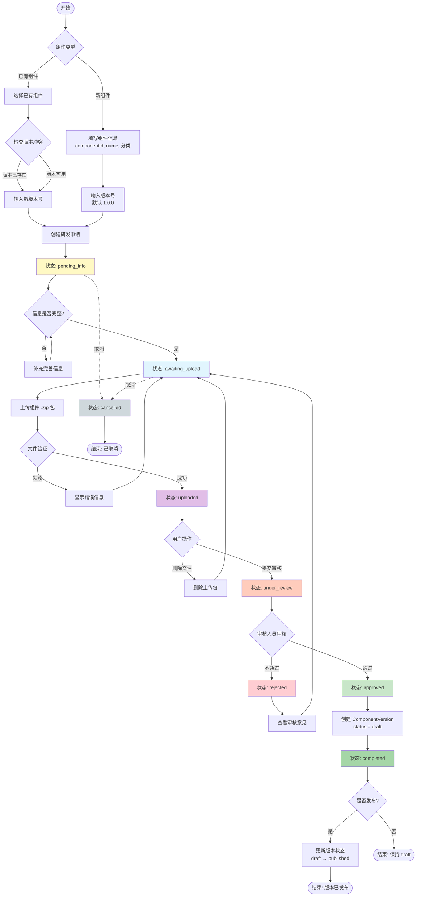
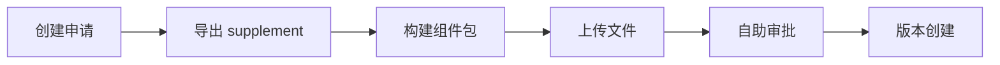
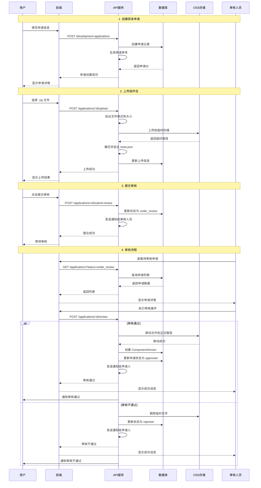

# 组件研发申请流程设计

## 📋 目录

- [1. 背景与目标](#1-背景与目标)
- [2. 核心概念](#2-核心概念)
- [3. 状态模型](#3-状态模型)
- [4. 完整流程](#4-完整流程)
- [5. 数据模型设计](#5-数据模型设计)
- [6. API接口设计](#6-api接口设计)
- [7. 权限控制](#7-权限控制)
- [8. 业务规则](#8-业务规则)

---

## 1. 背景与目标

### 1.1 现状分析

当前组件管理系统：

- ✅ 已有功能：组件上传、版本管理、分类管理
- ✅ 版本状态：`draft`（草稿）、`published`（已发布）
- ❌ 缺失功能：缺乏研发申请和审批流程

### 1.2 目标

建立完整的**组件研发申请流程**，实现：

1. 规范化的研发申请管理
2. 清晰的版本状态流转
3. 可追溯的审批记录
4. 灵活的文件上传与替换机制
5. **统一的上传入口**（废弃直接上传接口）

### 1.3 重要决策：废弃直接上传接口

**决策：** 废弃现有的 `POST /api/components/upload` 接口，所有组件上传必须通过研发申请流程。

**原因：**

| 问题             | 说明                                                                      |
| ---------------- | ------------------------------------------------------------------------- |
| 分类信息来源不清 | abd-cli 生成的 meta.json 不包含 `id`、`name`、`classification` 等关键信息 |
| 留有后门         | 直接上传绕过审批流程，与规范化管理目标冲突                                |
| 数据一致性       | 分类信息由开发者自行填写，可能与系统分类不一致                            |
| 可追溯性         | 直接上传缺乏申请记录，无法审计                                            |

**替代方案（管理员快速上传）：**

管理员可通过「自助审批」权限实现快速上传：

```
1. 创建研发申请（填写组件信息）
2. 导出 supplement 文件
3. 构建并上传组件包
4. 自己审批通过（特殊权限：development:application:self-approve）
```

**迁移计划：**

1. ✅ 新建研发申请模块
2. ✅ 标记旧接口为 `@Deprecated`
3. ✅ 前端跳转到新流程
4. ✅ 下个版本完全移除旧接口

---

## 2. 核心概念

### 2.1 研发申请（Development Application）

- 每次新增组件版本都需要创建研发申请
- 一个申请对应一个组件版本的完整生命周期
- 申请包含：基本信息、版本信息、上传文件、审批记录

### 2.2 适用场景

| 场景           | 说明                  | 要求                                               |
| -------------- | --------------------- | -------------------------------------------------- |
| **新组件创建** | 首次创建组件          | 需填写 componentId、name、选择分类，默认版本 1.0.0 |
| **版本迭代**   | 为已有组件添加新版本  | 选择已有组件，填写新版本号（不能冲突）             |
| **替换版本**   | 替换已有的 draft 版本 | 选择已有组件和 draft 版本，使用相同版本号          |

### 2.3 组件元数据文件拆分

为了更好地管理组件研发流程，组件元数据被拆分为两个文件：

#### A. component.meta.supplement.json（补充文件）

**来源：** 由研发申请系统生成或导出  
**生成时机：**

- **新组件创建**：根据用户填写的信息生成
- **版本迭代**：根据已有组件信息 + 用户填写的新版本号生成
- **替换版本**：导出现有版本的 supplement 文件

**作用：** 包含组件的基本标识和分类信息

```json
{
  "id": "DataTable",
  "name": "数据表格",
  "version": "1.0.0",
  "classification": {
    "level1": "table",
    "level2": "data-grid",
    "displayName": {
      "level1": "表格",
      "level2": "数据表格"
    }
  }
}
```

**字段说明：**

- `id`：组件唯一标识
- `name`：组件中文名称
- `version`：版本号
- `classification`：分类信息（含标识和显示名称）

**安全机制：**

- 🔒 **阶段1（当前）**：上传时逐字段校验文件内容与申请信息是否一致
  - 防止用户错误操作（上传错误的 supplement 文件）
  - 防止恶意篡改文件内容
  - 防止申请信息变更后使用旧文件
- 🔒 **阶段2（签名机制）**：对文件内容进行数字签名，简化校验流程
  - supplement 文件中包含 `applicationId` 和 `signature` 字段
  - 上传时验证：
    1. 基础格式（JSON 格式、必需字段）
    2. 签名有效性（防篡改）
    3. applicationId 匹配（防错传）
  - 省略逐字段对比，提升性能
  - ⚠️ 注意：不是完全不校验，而是从"5个字段对比"简化为"签名+ID验证"

---

#### B. component.meta.json（构建文件）

**来源：** 由 `abd-cli` 工具在构建时自动生成  
**时机：** 组件构建打包时  
**作用：** 包含组件的技术细节和构建信息

```json
{
  "description": "高性能数据表格组件",
  "type": "vue-component",
  "framework": "vue3",
  "author": {
    "organization": "江苏电力公司",
    "userName": "zhangsan"
  },
  "files": {
    "entry": "index.esm.js",
    "style": "style.css",
    "preview": "assets/preview.png"
  },
  "buildInfo": {
    "buildTime": "2026-01-07T10:30:00.000Z",
    "hash": "ea8bede9",
    "cliVersion": "1.0.0"
  },
  "license": "MIT"
}
```

**字段说明：**

- `description`：组件描述
- `type`：组件模板类型
- `framework`：开发框架
- `author`：作者信息
- `files`：文件路径配置
- `buildInfo`：构建信息
- `license`：许可证

---

#### C. 两个文件的关系

```
component.meta.supplement.json  +  component.meta.json  =  完整的组件元数据
  (申请系统生成/导出)                  (abd-cli 生成)              (系统合并)
         ↓                                   ↓                          ↓
     基本信息                            技术信息                   入库信息
  (id, name, version)              (description, files)      (Component + Version)
```

**文件来源总结：**

| 场景           | supplement 文件来源           | meta 文件来源    | 上传时要求         |
| -------------- | ----------------------------- | ---------------- | ------------------ |
| **新组件创建** | 系统根据用户填写信息生成      | abd-cli 构建生成 | 两个文件都必须存在 |
| **版本迭代**   | 系统根据已有组件+新版本号生成 | abd-cli 构建生成 | 两个文件都必须存在 |
| **替换版本**   | 系统导出现有版本的 supplement | abd-cli 构建生成 | 两个文件都必须存在 |

**验证规则：**

1. ✅ 两个文件必须同时存在（所有场景）
2. ✅ `component.meta.supplement.json` 的信息必须与申请一致
3. ✅ `component.meta.json` 必须包含必需字段
4. ✅ 文件结构和内容必须符合 JSON Schema

---

## 3. 状态模型

### 3.1 研发申请状态（Development Status）

```
┌─────────────────────────────────────────────────────────────────┐
│                    组件研发申请状态流转                          │
└─────────────────────────────────────────────────────────────────┘

  pending_info        待完善信息（初始状态）
      ↓
  awaiting_upload     等待上传（信息已完善）
      ↓
  uploaded            已上传（待审核）
      ↓                     ↓
  approved            ↓     rejected
  (审核通过)          ↓     (审核不通过)
      ↓               ↓          ↓
  completed           ↓     awaiting_upload
  (已完成)            ↓     (回到等待上传)
                      ↓
                  cancelled
                  (已取消)
```

#### 状态定义

| 状态代码          | 状态名称     | 说明                         | 可执行操作                             |
| ----------------- | ------------ | ---------------------------- | -------------------------------------- |
| `pending_info`    | 待完善信息   | 研发申请刚创建，信息尚未完善 | 编辑信息、取消申请                     |
| `awaiting_upload` | 等待上传     | 信息已完善，等待上传组件包   | 上传文件、编辑信息、取消申请           |
| `uploaded`        | 已上传待审核 | 组件包已上传，等待审核       | 删除上传文件（回到等待上传）、提交审核 |
| `under_review`    | 审核中       | 已提交审核，审核人员处理中   | 审核通过、审核不通过                   |
| `rejected`        | 审核不通过   | 审核未通过，需重新上传       | 上传新文件、查看审核意见               |
| `approved`        | 审核通过     | 审核通过，版本变为 draft     | 发布版本                               |
| `completed`       | 已完成       | 版本已发布为 published       | 查看详情                               |
| `cancelled`       | 已取消       | 申请已取消                   | 查看详情                               |

### 3.2 组件版本状态（Version Status）

保持现有状态不变，新增关联关系：

| 状态        | 说明   | 与研发申请的关系       |
| ----------- | ------ | ---------------------- |
| `draft`     | 草稿   | 研发申请审核通过后创建 |
| `published` | 已发布 | 从 draft 发布而来      |

---

## 4. 完整流程

### 4.1 流程图（Mermaid）



### 4.2 详细步骤说明

#### 步骤 1：发起研发申请

**用户选择组件类型：**

##### A. 新组件

```json
{
  "applicationType": "new",
  "componentId": "DataTable",
  "name": "数据表格",
  "description": "高性能数据表格组件",
  "classificationLevel1": "table",
  "classificationLevel2": "data-grid",
  "version": "1.0.0",
  "changelog": "初始版本"
}
```

**系统校验：**

- ✅ componentId 全局唯一
- ✅ 分类是否存在
- ✅ 版本号格式（Semver）

##### B. 已有组件新版本

```json
{
  "applicationType": "version",
  "componentId": "BarChart",
  "version": "2.1.0",
  "changelog": "新增数据钻取功能"
}
```

**系统校验：**

- ✅ 组件是否存在
- ✅ 版本号不冲突
- ✅ 版本号大于现有最高版本

**生成结果：**

- 创建 `DevelopmentApplication` 记录
- 状态：`pending_info`
- 生成申请单号：`APP-20260107-0001`
- 🎯 **自动生成 `component.meta.supplement.json`**

##### C. 替换已有版本

**适用场景：** 替换处于 `draft` 状态的版本  
**限制条件：** 只能替换 draft 状态，published 状态不可替换

```json
{
  "applicationType": "replace",
  "componentId": "BarChart",
  "version": "2.0.0",
  "existingVersionId": 123,
  "changelog": "修复性能问题，优化渲染逻辑"
}
```

**系统校验：**

- ✅ 组件是否存在
- ✅ 目标版本是否存在
- ✅ 目标版本状态是否为 `draft`
- ❌ `published` 状态的版本不能被替换

**生成结果：**

- 创建 `DevelopmentApplication` 记录
- 关联现有版本ID
- 🎯 **导出现有版本的 `component.meta.supplement.json`**

**替换版本与新版本的区别：**

| 项目                    | 新建版本                      | 替换版本                       |
| ----------------------- | ----------------------------- | ------------------------------ |
| **版本号**              | 必须不同于已有版本            | 使用相同版本号                 |
| **目标状态**            | 创建新的 ComponentVersion     | 更新现有 ComponentVersion      |
| **申请类型**            | `version`                     | `replace`                      |
| **supplement 文件来源** | 系统根据已有组件+新版本号生成 | 导出现有版本的 supplement 文件 |
| **meta 文件来源**       | abd-cli 构建生成              | abd-cli 构建生成               |

---

#### 步骤 1.5：导出组件元数据文件

创建申请后，系统提供文件导出功能：

**导出接口：**

```
GET /api/development-applications/:id/export-meta
```

**响应头：**

```
Content-Type: application/json
Content-Disposition: attachment; filename="component.meta.supplement.json"
```

---

##### A. 新组件创建

**supplement 文件生成规则：**

- 系统根据用户填写的信息自动生成
- 包含：componentId、name、version（默认1.0.0）、分类

**文件内容：**

```json
{
  "id": "DataTable",
  "name": "数据表格",
  "version": "1.0.0",
  "classification": {
    "level1": "table",
    "level2": "data-grid",
    "displayName": {
      "level1": "表格",
      "level2": "数据表格"
    }
  }
}
```

---

##### B. 版本迭代（新版本）

**supplement 文件生成规则：**

- 系统根据**已有组件信息** + **用户填写的新版本号**生成
- 继承组件的 componentId、name、分类
- 使用用户填写的新版本号

**文件内容：**

```json
{
  "id": "BarChart",
  "name": "柱状图",
  "version": "2.1.0",
  "classification": {
    "level1": "chart",
    "level2": "bar",
    "displayName": {
      "level1": "图表",
      "level2": "柱状图"
    }
  }
}
```

---

##### C. 替换版本

**supplement 文件生成规则：**

- 系统**导出**现有 draft 版本的 supplement 文件
- 保持所有信息不变（componentId、name、version、分类）

**文件内容：**

```json
{
  "id": "BarChart",
  "name": "柱状图",
  "version": "2.0.0",
  "classification": {
    "level1": "chart",
    "level2": "bar",
    "displayName": {
      "level1": "图表",
      "level2": "柱状图"
    }
  }
}
```

**注意：** 替换版本时，supplement 文件是从现有版本导出的，不需要修改任何内容。

---

**通用操作流程（适用所有场景）：**

1. 📥 点击"导出元数据文件"按钮
2. 💾 下载 `component.meta.supplement.json`
3. 📂 将文件放入组件包根目录
4. 🔨 使用 `abd-cli` 构建组件（自动生成 `component.meta.json`）
5. 📦 打包 .zip 文件（**必须包含两个 meta 文件**）
6. ⬆️ 上传组件包

**文件放置示例：**

```
MyComponent/
├── component.meta.supplement.json  ← 从申请系统导出（系统生成或导出）
├── component.meta.json              ← abd-cli 构建时自动生成
├── src/
│   └── index.vue
├── package.json
└── ...
```

---

#### 步骤 2：完善信息清单

**申请信息（存储在数据库）：**

```json
{
  "id": 1,
  "applicationNo": "APP-20260107-0001",
  "applicationType": "new",
  "componentId": "DataTable",
  "name": "数据表格",
  "description": "高性能数据表格组件",
  "classificationLevel1": "table",
  "classificationLevel2": "data-grid",
  "targetVersion": "1.0.0",
  "changelog": "初始版本",
  "developmentStatus": "pending_info",
  "applicantId": 10,
  "createdAt": "2026-01-07T10:30:00Z"
}
```

**前端展示的操作指南（不存数据库，仅用于UI展示）：**

```typescript
// 前端组件：ApplicationGuide.vue
const guideInfo = {
  // 1. 基本信息展示（来自申请数据）
  basicInfo: {
    applicationNo: application.applicationNo,
    componentId: application.componentId,
    name: application.name,
    version: application.targetVersion,
    classification: `${application.classificationLevel1} / ${application.classificationLevel2}`
  },

  // 2. 系统预定义的上传规则（写死的配置）
  uploadRequirements: {
    fileType: '.zip',
    maxSize: '50MB',
    requiredFiles: [
      'component.meta.supplement.json （从申请系统导出）',
      'component.meta.json （abd-cli 构建生成）',
      'index.esm.js 或其他入口文件'
    ],
    optionalFiles: ['style.css （样式文件）', 'assets/preview.png （预览图）']
  },

  // 3. 操作步骤指引（写死的配置）
  steps: [
    '1️⃣ 点击下方按钮导出 component.meta.supplement.json',
    '2️⃣ 将导出的文件放入组件包根目录',
    '3️⃣ 使用 abd-cli 构建组件（会自动生成 component.meta.json）',
    '4️⃣ 将两个 meta 文件和组件代码一起打包成 .zip',
    '5️⃣ 上传 .zip 文件到本页面'
  ]
}
```

**设计说明：**

- ✅ **申请信息**：存储在数据库的 `development_applications` 表中
- ✅ **上传规则**：系统配置，所有申请通用（可以写在配置文件或常量中）
- ✅ **操作指引**：前端 UI 文案，不涉及业务数据
- ❌ **不存储 framework、type**：这些信息在申请阶段不知道，只有上传后从 `component.meta.json` 中解析才知道

**操作流程：**

1. 用户查看申请信息和操作指引
2. 点击"导出元数据文件"按钮
3. 系统根据申请信息生成并下载 `component.meta.supplement.json`
4. 用户按照指引完成组件构建和打包
5. 状态变更：`pending_info` → `awaiting_upload`

---

#### 步骤 3：等待上传组件包

**前端展示：**

- 📤 上传区域：支持拖拽 .zip 文件
- 📋 信息清单展示
- 📝 文件要求说明

**用户操作：**

- 上传 .zip 文件
- 支持编辑信息（可补充描述）
- 可以取消申请

---

#### 步骤 4：上传组件包

**组件包结构要求：**

```
DataTable-1.0.0.zip
├── component.meta.supplement.json  ← 申请系统导出（必需）
├── component.meta.json              ← abd-cli 生成（必需）
├── index.esm.js                     ← 主入口文件（必需）
├── style.css                        ← 样式文件（可选）
└── assets/
    └── preview.png                  ← 预览图（可选）
```

**上传流程：**

1. 用户选择 .zip 文件
2. 前端验证：文件大小 < 50MB
3. 上传到临时存储（OSS）
4. 后端验证（按顺序）：
   - ✅ 解压文件
   - ✅ 检查 `component.meta.supplement.json` 是否存在
   - ✅ 检查 `component.meta.json` 是否存在
   - ✅ 解析两个 meta 文件的 JSON 格式
   - ✅ **关键验证：** supplement 文件内容与申请信息一致
   - ✅ 验证必需文件（entry、style、preview）是否存在
   - ✅ 合并两个 meta 文件生成完整元数据

**验证详情：**

##### A. supplement 文件验证

**阶段1（当前）- 逐字段校验：**

```typescript
// 验证规则
const validation = {
  id: supplement.id === application.componentId,
  name: supplement.name === application.name,
  version: supplement.version === application.targetVersion,
  level1: supplement.classification.level1 === application.classificationLevel1,
  level2: supplement.classification.level2 === application.classificationLevel2
}

if (!Object.values(validation).every((v) => v)) {
  throw new Error('component.meta.supplement.json 内容与申请信息不一致')
}
```

**为什么需要校验：**

- ✅ 防止用户上传错误的 supplement 文件（有多个申请时）
- ✅ 防止用户手动篡改文件内容
- ✅ 确保文件与最新申请信息一致

**阶段2（签名机制）- 签名验证：**

```typescript
// 简化的验证逻辑（但不是完全不校验）
const metadata = supplement._metadata

// 1. 基础格式验证（仍需要）
if (!supplement.id || !supplement.name || !supplement.version) {
  throw new Error('supplement 文件缺少必需字段')
}

// 2. 验证签名（防篡改）
const isSignatureValid = verifySignature(supplement, metadata.signature)
if (!isSignatureValid) {
  throw new Error('文件签名无效，可能已被篡改')
}

// 3. 验证申请ID匹配（防错传）
if (metadata.applicationId !== application.id) {
  throw new Error('该文件不属于当前申请')
}

// ✅ 签名有效 = 内容未篡改 = 与申请一致
// ❌ 无需逐字段对比（id、name、version、classification）
```

**签名机制的优势：**

- ✅ 省略逐字段对比（从 5 个字段对比减少到 2 个验证）
- ✅ 性能更高（签名验证是 O(1) 操作）
- ✅ 更安全（密钥保护，难以伪造）
- ⚠️ 但仍需基础验证（格式、必需字段、申请匹配）

##### B. 完整性验证

```typescript
// 必需文件检查
const requiredFiles = [
  'component.meta.supplement.json',
  'component.meta.json',
  metaJson.files.entry // 如：index.esm.js
]

// 可选文件检查
const optionalFiles = [
  metaJson.files.style, // 如：style.css
  metaJson.files.preview // 如：assets/preview.png
]
```

**验证成功：**

```json
{
  "applicationId": "APP-20260107-0001",
  "status": "uploaded",
  "uploadInfo": {
    "fileName": "DataTable-1.0.0.zip",
    "fileSize": 2456789,
    "uploadTime": "2026-01-07 11:00:00",
    "tempPath": "temp/APP-20260107-0001/DataTable-1.0.0.zip",
    "checksum": "sha256:abc123..."
  },
  "validationResult": {
    "supplementMatch": true,
    "metaValid": true,
    "filesComplete": true,
    "warnings": []
  }
}
```

**验证失败示例：**

```json
{
  "code": 400,
  "message": "组件包验证失败",
  "errors": [
    "component.meta.supplement.json 中的 componentId 与申请不一致",
    "component.meta.supplement.json: 期望 'DataTable'，实际 'DataGrid'",
    "缺少必需文件：component.meta.json"
  ]
}
```

状态变更：`awaiting_upload` → `uploaded`

---

#### 步骤 5：待审核状态

**用户可执行操作：**

- ❌ **删除上传包**：删除已上传的文件，回到 `awaiting_upload` 状态
- ✅ **提交审核**：将申请提交给审核人员
- 📄 查看上传文件信息

**提交审核后：**
状态变更：`uploaded` → `under_review`

**操作限制：**

- 🚫 不能再删除上传包
- 🚫 不能编辑信息
- ✅ 可以查看审核进度

---

#### 步骤 6：审核流程

**审核人员操作：**

##### A. 审核通过

```json
{
  "applicationId": "APP-20260107-0001",
  "reviewAction": "approve",
  "reviewComment": "代码质量良好，符合规范",
  "reviewerId": 1,
  "reviewTime": "2026-01-07 14:30:00"
}
```

**系统处理：**

1. **使用 OSS 服务端复制**将临时文件迁移到正式存储路径
   - 从：`temp/APP-20260107-0001/`
   - 到：`components/DataTable/1.0.0/`
   - 🔧 **技术方案**：使用 OSS CopyObject API（服务端复制）
   - ✅ **优势**：不需要下载后重新上传，节省带宽和时间
   - 📋 **实现方式**：
     ```typescript
     // 伪代码示例
     await ossClient.copy(
       `components/DataTable/1.0.0/component.zip`,
       `temp/APP-20260107-0001/component.zip`
     )
     // 复制成功后删除临时文件
     await ossClient.delete(`temp/APP-20260107-0001/component.zip`)
     ```
2. 创建 `ComponentVersion` 记录，状态为 `draft`
3. 如果是新组件，创建 `Component` 记录
4. 更新申请状态：`under_review` → `approved`

##### B. 审核不通过

```json
{
  "applicationId": "APP-20260107-0001",
  "reviewAction": "reject",
  "reviewComment": "缺少组件描述，preview.png 图片质量不佳",
  "reviewerId": 1,
  "reviewTime": "2026-01-07 14:30:00"
}
```

**系统处理：**

1. 删除临时上传文件
2. 更新申请状态：`under_review` → `rejected`
3. 通知申请人

**申请人后续操作：**

- 查看审核意见
- 修复问题后重新上传
- 状态回到：`awaiting_upload`

---

#### 步骤 7：研发完成

**状态：** `approved`

**版本信息：**

```json
{
  "componentId": "DataTable",
  "version": "1.0.0",
  "status": "draft",
  "entryUrl": "https://oss.example.com/components/DataTable/1.0.0/index.esm.js",
  "styleUrl": "https://oss.example.com/components/DataTable/1.0.0/style.css"
}
```

**后续操作：**

- ✅ 发布版本：`draft` → `published`
- 📄 查看版本详情
- 🔄 继续研发新版本

申请状态变更：`approved` → `completed`（当版本发布后）

---

## 5. 数据模型设计

### 5.1 新增实体：DevelopmentApplication

```typescript
/**
 * 组件研发申请表
 */
@Entity('development_applications')
export class DevelopmentApplication extends BaseEntity {
  /**
   * 申请单号（唯一）
   * 格式：APP-YYYYMMDD-XXXX
   */
  @Column({ type: 'varchar', length: 50, unique: true, name: 'application_no' })
  applicationNo: string

  /**
   * 申请类型
   * new = 新组件, version = 版本迭代, replace = 替换版本
   */
  @Column({ type: 'varchar', length: 20, name: 'application_type' })
  applicationType: 'new' | 'version' | 'replace'

  /**
   * 组件ID
   */
  @Column({ type: 'varchar', length: 100, name: 'component_id' })
  componentId: string

  /**
   * 组件名称（新组件时必填）
   */
  @Column({ type: 'varchar', length: 100, nullable: true })
  name: string | null

  /**
   * 组件描述
   */
  @Column({ type: 'text', nullable: true })
  description: string | null

  /**
   * 一级分类
   */
  @Column({ type: 'varchar', length: 50, nullable: true, name: 'classification_level1' })
  classificationLevel1: string | null

  /**
   * 二级分类
   */
  @Column({ type: 'varchar', length: 50, nullable: true, name: 'classification_level2' })
  classificationLevel2: string | null

  /**
   * 一级分类显示名称（用于导出 supplement 文件）
   */
  @Column({ type: 'varchar', length: 100, nullable: true, name: 'classification_level1_name' })
  classificationLevel1Name: string | null

  /**
   * 二级分类显示名称（用于导出 supplement 文件）
   */
  @Column({ type: 'varchar', length: 100, nullable: true, name: 'classification_level2_name' })
  classificationLevel2Name: string | null

  /**
   * 目标版本号
   */
  @Column({ type: 'varchar', length: 50, name: 'target_version' })
  targetVersion: string

  /**
   * 版本更新日志
   */
  @Column({ type: 'text', nullable: true })
  changelog: string | null

  /**
   * 研发申请状态
   */
  @Column({
    type: 'varchar',
    length: 20,
    default: 'pending_info',
    name: 'development_status'
  })
  developmentStatus:
    | 'pending_info'
    | 'awaiting_upload'
    | 'uploaded'
    | 'under_review'
    | 'rejected'
    | 'approved'
    | 'completed'
    | 'cancelled'

  /**
   * 上传文件信息（JSON）
   */
  @Column({ type: 'json', nullable: true, name: 'upload_info' })
  uploadInfo: {
    fileName?: string
    fileSize?: number
    uploadTime?: Date
    tempPath?: string
    checksum?: string
  } | null

  /**
   * 审核信息（JSON）
   */
  @Column({ type: 'json', nullable: true, name: 'review_info' })
  reviewInfo: {
    reviewerId?: number
    reviewerName?: string
    reviewTime?: Date
    reviewAction?: 'approve' | 'reject'
    reviewComment?: string
  } | null

  /**
   * 关联的组件版本ID（审核通过后创建）
   */
  @Column({ type: 'int', nullable: true, name: 'component_version_id' })
  componentVersionId: number | null

  /**
   * 关联的现有版本ID（仅替换版本场景使用）
   * 当 applicationType = 'replace' 时，指向要被替换的 draft 版本
   */
  @Column({ type: 'int', nullable: true, name: 'existing_version_id' })
  existingVersionId: number | null

  /**
   * 申请人ID
   */
  @Column({ type: 'int', name: 'applicant_id' })
  applicantId: number

  /**
   * 申请人关系
   */
  @ManyToOne(() => User)
  @JoinColumn({ name: 'applicant_id' })
  applicant: User

  /**
   * 审核人ID
   */
  @Column({ type: 'int', nullable: true, name: 'reviewer_id' })
  reviewerId: number | null

  /**
   * 审核人关系
   */
  @ManyToOne(() => User, { nullable: true })
  @JoinColumn({ name: 'reviewer_id' })
  reviewer: User | null

  /**
   * 提交审核时间
   */
  @Column({ type: 'timestamp', nullable: true, name: 'submitted_at' })
  submittedAt: Date | null

  /**
   * 审核完成时间
   */
  @Column({ type: 'timestamp', nullable: true, name: 'reviewed_at' })
  reviewedAt: Date | null

  /**
   * 完成时间（版本发布时间）
   */
  @Column({ type: 'timestamp', nullable: true, name: 'completed_at' })
  completedAt: Date | null
}
```

### 5.2 索引设计

```sql
-- 申请单号唯一索引
CREATE UNIQUE INDEX idx_application_no ON development_applications(application_no);

-- 组件ID索引
CREATE INDEX idx_component_id ON development_applications(component_id);

-- 状态索引
CREATE INDEX idx_development_status ON development_applications(development_status);

-- 申请人索引
CREATE INDEX idx_applicant_id ON development_applications(applicant_id);

-- 审核人索引
CREATE INDEX idx_reviewer_id ON development_applications(reviewer_id);

-- 组合索引：组件ID + 版本号
-- 注意：不设为唯一索引，因为取消的申请版本号可被复用
-- 版本号唯一性通过业务逻辑校验（排除 cancelled 状态）
CREATE INDEX idx_component_version
ON development_applications(component_id, target_version);

-- 关联版本索引（用于替换版本场景）
CREATE INDEX idx_existing_version_id ON development_applications(existing_version_id);
```

**版本号唯一性校验逻辑：**

```typescript
// 检查版本号是否可用（排除已取消的申请）
const existingApplication = await this.repository.findOne({
  where: {
    componentId,
    targetVersion,
    developmentStatus: Not(In(['cancelled']))
  }
})
if (existingApplication) {
  throw new BusinessException('版本号已被占用')
}
```

---

## 6. API接口设计

### 6.1 创建研发申请

**POST** `/api/development-applications`

**请求体（新组件）：**

```json
{
  "applicationType": "new",
  "componentId": "DataTable",
  "name": "数据表格",
  "description": "高性能数据表格组件",
  "classificationLevel1": "table",
  "classificationLevel2": "data-grid",
  "targetVersion": "1.0.0",
  "changelog": "初始版本"
}
```

**请求体（版本迭代）：**

```json
{
  "applicationType": "version",
  "componentId": "BarChart",
  "targetVersion": "2.1.0",
  "changelog": "新增数据钻取功能"
}
```

**请求体（替换版本）：**

```json
{
  "applicationType": "replace",
  "componentId": "BarChart",
  "targetVersion": "2.0.0",
  "existingVersionId": 123,
  "changelog": "修复性能问题"
}
```

**响应：**

```json
{
  "code": 200,
  "message": "研发申请创建成功",
  "data": {
    "id": 1,
    "applicationNo": "APP-20260107-0001",
    "developmentStatus": "pending_info",
    "createdAt": "2026-01-07T10:30:00Z"
  }
}
```

---

### 6.2 导出组件元数据文件

**GET** `/api/development-applications/:id/export-meta`

**适用状态：** `pending_info`、`awaiting_upload`

**响应头：**

```
Content-Type: application/json
Content-Disposition: attachment; filename="component.meta.supplement.json"
```

**响应体（新组件/版本迭代）：**

```json
{
  "id": "DataTable",
  "name": "数据表格",
  "version": "1.0.0",
  "classification": {
    "level1": "table",
    "level2": "data-grid",
    "displayName": {
      "level1": "表格",
      "level2": "数据表格"
    }
  },
  "_metadata": {
    "applicationId": 1,
    "applicationNo": "APP-20260107-0001",
    "exportTime": "2026-01-07T10:30:00Z",
    "signature": "SHA256_HMAC_SIGNATURE_PLACEHOLDER"
  }
}
```

**说明：**

- `_metadata` 字段用于追溯和防篡改
- `signature` 字段在阶段2（签名机制）实现后启用
- 阶段1仍需逐字段校验，阶段2只需验证签名

**响应体（替换版本）：**

```json
{
  "id": "BarChart",
  "name": "柱状图",
  "
}
```

**说明：** 替换版本时导出的是现有 draft 版本的原始 supplement 文件，不需要额外的元数据标记。 }
},
"\_metadata": {
"isReplacement": true,
"originalVersionId": 123,
"exportTime": "2026-01-07T10:30:00Z"
}
}

````

---

### 6.3 上传组件包

**POST** `/api/development-applications/:id/upload`

**请求：** `multipart/form-data`
- `file`: .zip 文件

**响应：**
```json
{
  "code": 200,
  "message": "组件包上传成功",
  "data": {
    "applicationNo": "APP-20260107-0001",
    "developmentStatus": "uploaded",
    "uploadInfo": {
      "fileName": "DataTable-1.0.0.zip",
      "fileSize": 2456789,
      "uploadTime": "2026-01-07T11:00:00Z"
    },
    "validationResult": {
      "supplementMatch": true,
      "metaValid": true,
      "filesComplete": true
    }
  }
}
````

---

### 6.4 删除上传包

**DELETE** `/api/development-applications/:id/upload`

**适用状态：** `uploaded`

**响应：**

```json
{
  "code": 200,
  "message": "上传包已删除",
  "data": {
    "developmentStatus": "awaiting_upload"
  }
}
```

---

### 6.5 提交审核

**POST** `/api/development-applications/:id/submit-review`

**响应：**

```json
{
  "code": 200,
  "message": "已提交审核",
  "data": {
    "developmentStatus": "under_review",
    "submittedAt": "2026-01-07T12:00:00Z"
  }
}
```

---

### 6.6 审核申请

**POST** `/api/development-applications/:id/review`

**请求体：**

```json
{
  "reviewAction": "approve",
  "reviewComment": "审核通过"
}
```

**响应：**

```json
{
  "code": 200,
  "message": "审核完成",
  "data": {
    "developmentStatus": "approved",
    "componentVersionId": 123,
    "reviewInfo": {
      "reviewerId": 1,
      "reviewerName": "admin",
      "reviewAction": "approve",
      "reviewComment": "审核通过",
      "reviewTime": "2026-01-07T14:30:00Z"
    }
  }
}
```

---

### 6.7 查询申请列表

**GET** `/api/development-applications`

**查询参数：**

- `status`: 状态筛选
- `applicationType`: 类型筛选
- `componentId`: 组件ID筛选
- `applicantId`: 申请人筛选
- `page`: 页码
- `limit`: 每页数量

---

### 6.8 查询申请详情

**GET** `/api/development-applications/:id`

**响应：**

```json
{
  "code": 200,
  "data": {
    "id": 1,
    "applicationNo": "APP-20260107-0001",
    "applicationType": "new",
    "componentId": "DataTable",
    "name": "数据表格",
    "targetVersion": "1.0.0",
    "developmentStatus": "approved",
    "uploadInfo": { ... },
    "reviewInfo": { ... },
    "applicant": {
      "id": 10,
      "username": "zhangsan"
    },
    "createdAt": "2026-01-07T10:30:00Z"
  }
}
```

---

### 6.9 取消申请

**POST** `/api/development-applications/:id/cancel`

**适用状态：** `pending_info`、`awaiting_upload`

**说明：** 取消申请后，版本号会**立即释放**，可被其他申请使用。

**响应：**

```json
{
  "code": 200,
  "message": "申请已取消",
  "data": {
    "developmentStatus": "cancelled",
    "cancelledAt": "2026-01-07T15:00:00Z"
  }
}
```

**错误响应（状态不允许取消）：**

```json
{
  "code": 400,
  "message": "当前状态不允许取消申请",
  "error": {
    "currentStatus": "under_review",
    "allowedStatuses": ["pending_info", "awaiting_upload"]
  }
}
```

---

### 6.10 编辑申请信息

**PATCH** `/api/development-applications/:id`

**适用状态：** `pending_info`、`awaiting_upload`

**请求体（部分更新）：**

```json
{
  "name": "数据表格组件",
  "description": "高性能数据表格组件，支持虚拟滚动",
  "changelog": "初始版本，支持基础表格功能"
}
```

**可编辑字段：**

| 字段                   | 新组件 | 版本迭代 | 替换版本 | 说明               |
| ---------------------- | ------ | -------- | -------- | ------------------ |
| `name`                 | ✅     | ❌       | ❌       | 仅新组件可修改名称 |
| `description`          | ✅     | ✅       | ✅       | 所有类型可修改     |
| `classificationLevel1` | ✅     | ❌       | ❌       | 仅新组件可修改分类 |
| `classificationLevel2` | ✅     | ❌       | ❌       | 仅新组件可修改分类 |
| `changelog`            | ✅     | ✅       | ✅       | 所有类型可修改     |

**响应：**

```json
{
  "code": 200,
  "message": "申请信息已更新",
  "data": {
    "id": 1,
    "applicationNo": "APP-20260107-0001",
    "name": "数据表格组件",
    "description": "高性能数据表格组件，支持虚拟滚动",
    "changelog": "初始版本，支持基础表格功能",
    "updatedAt": "2026-01-07T11:30:00Z"
  }
}
```

**注意：** 编辑申请信息后，需要重新导出 `component.meta.supplement.json` 文件。

---

## 7. 权限控制

### 7.1 权限定义

| 权限代码                               | 权限名称     | 说明                               |
| -------------------------------------- | ------------ | ---------------------------------- |
| `development:application:create`       | 创建研发申请 | 开发人员权限                       |
| `development:application:edit`         | 编辑申请信息 | 申请人本人                         |
| `development:application:upload`       | 上传组件包   | 开发人员权限                       |
| `development:application:submit`       | 提交审核     | 开发人员权限                       |
| `development:application:review`       | 审核申请     | 审核人员权限                       |
| `development:application:self-approve` | 自助审批     | 管理员权限，允许审批自己创建的申请 |
| `development:application:view`         | 查看申请     | 所有人                             |
| `development:application:cancel`       | 取消申请     | 申请人本人                         |

### 7.2 角色配置

**开发人员（Developer）：**

- ✅ 创建研发申请
- ✅ 编辑申请信息（本人申请）
- ✅ 上传组件包
- ✅ 提交审核
- ✅ 取消申请（本人申请）
- ✅ 查看自己的申请

**审核人员（Reviewer）：**

- ✅ 查看所有申请
- ✅ 审核申请
- ✅ 查看审核记录

**管理员（Admin）：**

- ✅ 所有权限
- ✅ 自助审批（可审批自己创建的申请，用于快速上传场景）

---

## 8. 业务规则

### 8.1 版本号规则

1. **版本号格式：** 遵循 Semver 规范（如：1.0.0, 2.1.3）
2. **新组件：** 默认版本 1.0.0
3. **版本迭代：** 新版本号必须大于现有最高版本
4. **版本唯一性：** 同一组件不能有重复版本号
5. **版本号占用与释放：**
   - ✅ 创建申请时占用版本号（防止冲突）
   - ✅ 申请状态为 `cancelled` 时**自动释放版本号**
   - ✅ 释放后该版本号可被其他申请使用
   - 📋 **业务闭环规则：**
     - `pending_info` → `cancelled`：释放版本号
     - `awaiting_upload` → `cancelled`：释放版本号
     - 其他状态不允许取消，版本号保持占用
   - 🔍 **版本号校验逻辑：**
     ```typescript
     // 检查版本号是否可用
     const existingApplication = await this.findOne({
       componentId,
       targetVersion,
       developmentStatus: Not(In(['cancelled'])) // 排除已取消的申请
     })
     if (existingApplication) {
       throw new Error('版本号已被占用')
     }
     ```

### 8.2 上传入口统一规则

**唯一上传入口：** `POST /api/development-applications/:id/upload`

**废弃接口：** `POST /api/components/upload`（标记为 `@Deprecated`，下版本移除）

**原因：**

1. **分类信息规范化**：分类信息由系统管理，不允许开发者自行填写
2. **流程规范化**：所有组件上传都需要经过申请-审批流程
3. **可追溯性**：每次上传都有对应的申请记录，便于审计

**管理员快速上传流程：**



**自助审批规则：**

- 仅管理员拥有 `development:application:self-approve` 权限
- 自助审批会记录审核人 = 申请人，便于追溯
- 审核意见自动填充为"管理员自助审批"

### 8.3 文件上传规则

1. **文件类型：** 仅支持 .zip 格式
2. **文件大小：** 最大 50MB
3. **必需文件：**
   - `component.meta.supplement.json`（申请系统导出）
   - `component.meta.json`（abd-cli 生成）
   - 主入口文件（如：`index.esm.js`）
4. **验证规则：**
   - ✅ `component.meta.supplement.json` 必须存在
   - ✅ `component.meta.json` 必须存在
   - ✅ supplement 文件的 `id` 必须与申请的 `componentId` 一致
   - ✅ supplement 文件的 `name` 必须与申请的 `name` 一致
   - ✅ supplement 文件的 `version` 必须与申请的 `targetVersion` 一致
   - ✅ supplement 文件的分类信息必须与申请一致
   - ✅ meta 文件中声明的文件必须存在于 zip 包中
5. **安全规则：**
   - 🔒 **阶段1（当前）**：上传时逐字段校验 supplement 文件与申请信息一致
     - 防止上传错误的文件（多个申请时）
     - 防止手动篡改文件内容
   - 🔒 **阶段2（签名机制）**：supplement 文件包含数字签名
     - 只需验证签名有效性和申请ID匹配
     - 无需逐字段对比，简化校验流程
     - 实现方式：HMAC-SHA256 签名算法

### 8.4 版本替换规则

1. **可替换条件：**
   - ✅ 版本状态必须为 `draft`
   - ✅ 必须通过研发申请流程
   - ✅ 需要使用相同的版本号
2. **不可替换条件：**
   - ❌ `published` 状态的版本不可替换
   - ❌ 已删除的版本不可替换
3. **替换流程：**
   - 创建类型为 `replace` 的研发申请
   - 关联现有的 draft 版本ID
   - 上传新的组件包
   - 审核通过后更新现有版本记录
4. **数据保留：**
   - 保留原版本的创建时间
   - 更新修改时间和修改人
   - 保留版本ID不变

### 8.5 状态流转规则

| 当前状态          | 可流转状态        | 触发条件     | 版本号状态         |
| ----------------- | ----------------- | ------------ | ------------------ |
| `pending_info`    | `awaiting_upload` | 信息完善     | 保持占用           |
| `pending_info`    | `cancelled`       | 取消申请     | **释放版本号** ✅  |
| `awaiting_upload` | `uploaded`        | 上传文件成功 | 保持占用           |
| `awaiting_upload` | `cancelled`       | 取消申请     | **释放版本号** ✅  |
| `uploaded`        | `awaiting_upload` | 删除上传包   | 保持占用           |
| `uploaded`        | `under_review`    | 提交审核     | 保持占用           |
| `under_review`    | `approved`        | 审核通过     | 保持占用           |
| `under_review`    | `rejected`        | 审核不通过   | 保持占用           |
| `rejected`        | `awaiting_upload` | 自动回退     | 保持占用           |
| `approved`        | `completed`       | 版本发布     | 保持占用（已创建） |

### 8.6 删除规则

| 状态              | 是否可删除上传包 | 是否可取消申请 |
| ----------------- | ---------------- | -------------- |
| `pending_info`    | N/A              | ✅             |
| `awaiting_upload` | N/A              | ✅             |
| `uploaded`        | ✅               | ❌             |
| `under_review`    | ❌               | ❌             |
| `rejected`        | ❌               | ❌             |
| `approved`        | ❌               | ❌             |
| `completed`       | ❌               | ❌             |

### 8.7 取消申请与版本号释放

**可取消的状态：**

- ✅ `pending_info`：信息尚未完善，可以取消
- ✅ `awaiting_upload`：尚未上传文件，可以取消

**不可取消的状态：**

- ❌ `uploaded`：已上传文件，需通过删除上传包回退
- ❌ `under_review`：正在审核中，不可取消
- ❌ `rejected`：已被拒绝，会自动回到 `awaiting_upload`
- ❌ `approved`：已审核通过，不可取消
- ❌ `completed`：已完成，不可取消

**版本号释放机制：**

```typescript
// 取消申请的业务逻辑
async cancelApplication(id: number) {
  const application = await this.findOne(id);

  // 1. 检查是否可取消
  const cancellableStatuses = ['pending_info', 'awaiting_upload'];
  if (!cancellableStatuses.includes(application.developmentStatus)) {
    throw new Error('当前状态不允许取消申请');
  }

  // 2. 更新状态为 cancelled
  application.developmentStatus = 'cancelled';
  await this.save(application);

  // 3. 版本号自动释放，其他申请可使用该版本号
  // （无需额外操作，查询时排除 cancelled 状态即可）

  return application;
}
```

**业务闭环保证：**

1. **创建申请时检查版本号：**

   ```sql
   SELECT * FROM development_applications
   WHERE component_id = 'DataTable'
     AND target_version = '1.0.0'
     AND development_status != 'cancelled'; -- 排除已取消
   ```

2. **取消后版本号立即可用：**
   - 申请A：DataTable v1.0.0，状态 `awaiting_upload`
   - 操作：取消申请A → 状态变为 `cancelled`
   - 结果：可以立即创建申请B使用 DataTable v1.0.0

3. **最终状态只有两种：**
   - ✅ `completed`：版本已发布，版本号永久占用
   - ✅ `cancelled`：申请已取消，版本号已释放

**API接口：**

```typescript
// POST /api/development-applications/:id/cancel
{
  "code": 200,
  "message": "申请已取消，版本号已释放",
  "data": {
    "applicationNo": "APP-20260107-0001",
    "developmentStatus": "cancelled",
    "releasedVersion": "1.0.0",
    "cancelledAt": "2026-01-07T15:30:00Z"
  }
}
```

---

## 9. 扩展考虑

### 9.1 通知机制

- ✉️ 提交审核时通知审核人员
- ✉️ 审核完成时通知申请人
- ✉️ 版本发布时通知相关人员

### 9.2 审批流程扩展

- 多级审批（技术审批 → 产品审批）
- 审批委托
- 批量审批

### 9.3 统计分析

- 研发申请数量统计
- 审核通过率分析
- 平均审核时长
- 组件发布趋势

---

## 10. 时序图

### 10.1 完整流程时序图



---

## 11. 实现建议

### 11.1 分阶段实施

**阶段1：基础功能（MVP）**

- ✅ 创建研发申请
- ✅ 上传组件包
- ✅ 基础审核流程
- ✅ 状态流转

**阶段2：增强功能**

- ✅ 通知机制
- ✅ 审核意见反馈
- ✅ 文件替换功能

**阶段3：高级功能**

- ✅ 多级审批
- ✅ 统计分析
- ✅ 审批流程可配置

### 11.2 技术栈建议

- **后端框架：** NestJS（已有）
- **数据库：** MySQL + TypeORM（已有）
- **文件存储：** OSS（阿里云/腾讯云）
- **消息通知：** WebSocket / Server-Sent Events
- **任务队列：** Bull（文件处理）

---

## 12. FAQ

### Q1: 为什么需要"研发申请"而不是直接上传？

**A:** 研发申请流程可以：

- 提前规划版本和功能
- 避免版本号冲突
- 建立审批和质量把控机制
- 提供可追溯的研发记录

### Q2: 审核不通过后，是否需要重新创建申请？

**A:** 不需要，申请状态会回到 `awaiting_upload`，用户可以修复问题后重新上传。

### Q3: 已上传的文件可以被替换吗？

**A:**

- ✅ `uploaded` 状态：可以删除后重新上传
- ❌ `under_review` 状态：不可删除或替换
- ❌ `approved` 状态：不可删除或替换

### Q4: 一个组件可以同时有多个研发申请吗？

**A:** 可以，但同一个版本号只能有一个有效申请。

### Q5: 为什么要将 component.meta.json 拆分成两个文件？

**A:**

- **职责分离**：supplement 文件由申请系统管理（基本信息），meta 文件由构建工具生成（技术信息）
- **防止篡改**：supplement 文件可以加密签名，确保用户不能随意修改组件标识和分类
- **流程规范**：确保组件信息与研发申请一致，避免上传时信息不匹配
- **版本追溯**：supplement 文件记录了申请来源，便于追溯

### Q6: 什么情况下可以替换已有版本？

**A:**

- ✅ **可以替换**：版本状态为 `draft`（草稿）
- ❌ **不能替换**：版本状态为 `published`（已发布）
- **原因**：draft 版本尚未对外发布，可以修改；published 版本已被使用，不能修改以保证稳定性

### Q7: 替换版本和创建新版本有什么区别？

**A:**

| 项目         | 创建新版本                     | 替换版本                       |
| ------------ | ------------------------------ | ------------------------------ |
| **版本号**   | 必须是新的版本号               | 使用相同版本号                 |
| **申请类型** | `version`                      | `replace`                      |
| **目标操作** | 创建新的 ComponentVersion 记录 | 更新现有 ComponentVersion 记录 |
| **使用场景** | 功能迭代、新特性               | 修复 bug、优化性能             |
| **文件导出** | 导出 supplement 文件           | 导出完整 meta 信息             |

### Q8: 如果忘记将 component.meta.supplement.json 放入组件包会怎样？

**A:** 上传时会验证失败，提示"缺少必需文件：component.meta.supplement.json"。必须重新打包上传。

### Q9: 取消申请后，版本号可以立即被其他申请使用吗？

**A:** 是的，取消申请后版本号会**立即释放**。

- ✅ 申请A使用 DataTable v1.0.0，状态为 `awaiting_upload`
- ✅ 取消申请A → 状态变为 `cancelled`
- ✅ 立即可以创建申请B使用 DataTable v1.0.0
- 🔒 系统查询时会排除 `cancelled` 状态的申请

### Q10: OSS 文件迁移是如何实现的？

**A:** 使用 **OSS 服务端复制**（Server-Side Copy）技术：

- 🔧 **技术方案**：调用 OSS CopyObject API
- ✅ **优势**：
  - 不需要下载文件到应用服务器
  - 不需要重新上传文件
  - 节省带宽和时间
  - 保证文件完整性
- 📋 **流程**：
  1. 审核通过后，调用 OSS CopyObject
  2. 从 `temp/APP-20260107-0001/` 复制到 `components/DataTable/1.0.0/`
  3. 复制成功后删除临时文件
  4. 所有操作在 OSS 服务端完成

### Q11: 哪些状态是最终状态（不可再变更）？

**A:** 两个最终状态：

- ✅ `completed`：版本已发布，流程正常结束
- ✅ `cancelled`：申请已取消，流程提前结束

这两个状态都不可再变更，形成业务闭环。

### Q12: 为什么 supplement 文件已经是系统导出的，上传时还要校验？

**A:** 出于安全和防错考虑，仍需校验：

**需要校验的原因：**

- 🔴 **防止错传**：用户可能同时有多个申请，下载了申请A的文件却上传到申请B
- 🔴 **防止篡改**：当前阶段签名机制未实现，用户可能手动修改文件
- 🔴 **信息变更**：用户可能在导出文件后修改了申请信息，需确保一致性

**优化方案（阶段2）：**

实现数字签名机制后，可简化校验：

```json
{
  "id": "DataTable",
  "name": "数据表格",
  "version": "1.0.0",
  "classification": { ... },
  "_metadata": {
    "applicationId": 1,
    "applicationNo": "APP-20260107-0001",
    "signature": "SHA256_HMAC_SIGNATURE"
  }
}
```

**简化后的校验流程：**

- ✅ 基础格式验证（JSON、必需字段）
- ✅ 签名有效性验证（防篡改）
- ✅ applicationId 匹配验证（防错传）
- ❌ 省略逐字段对比（id、name、version、classification）

**原理：** 签名有效 = 内容未被修改 = 与申请创建时一致

**性能提升：** 从 O(n) 字段对比简化为 O(1) 签名验证

---

## 📌 总结

本设计方案提供了完整的组件研发申请流程，包括：

✅ **清晰的状态流转** - 8 个状态覆盖全流程  
✅ **灵活的文件管理** - 支持上传、删除、替换  
✅ **规范的审批机制** - 审核通过/不通过的完整流程  
✅ **扩展性设计** - 支持多级审批、通知、统计等扩展  
✅ **权限控制** - 基于角色的访问控制  
✅ **API 完整性** - 10 个接口覆盖全部业务场景  
✅ **统一上传入口** - 废弃直接上传，所有组件通过申请流程上传

---

**文档版本：** v1.2  
**创建日期：** 2026-01-07  
**更新日期：** 2026-01-07  
**作者：** GitHub Copilot

**v1.2 更新内容：**

- 新增 1.3 重要决策：废弃直接上传接口
- 新增 8.2 上传入口统一规则
- 新增 `development:application:self-approve` 自助审批权限
- 更新管理员角色权限说明
- 调整章节编号（8.3-8.7）

**v1.1 更新内容：**

- 补充实体字段：`classificationLevel1Name`、`classificationLevel2Name`、`existingVersionId`
- 修复 6.2 导出接口响应体（替换版本场景）
- 修正接口编号（6.4-6.8）
- 新增 6.9 取消申请接口
- 新增 6.10 编辑申请信息接口
- 更新权限定义，增加 `development:application:edit`
- 优化索引设计说明，明确版本号唯一性校验逻辑
