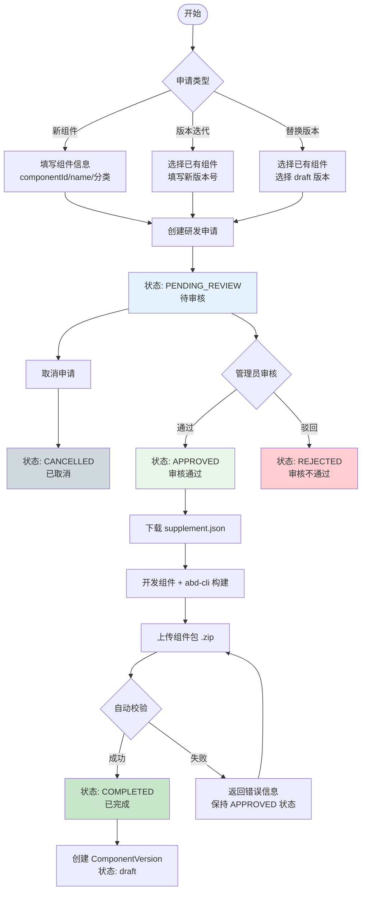

# 组件研发申请流程设计

## 📋 目录

- [1. 背景与目标](#1-背景与目标)
- [2. 核心概念](#2-核心概念)
- [3. 状态模型](#3-状态模型)
- [4. 完整流程](#4-完整流程)
- [5. 数据模型设计](#5-数据模型设计)
- [6. API 接口设计](#6-api-接口设计)
- [7. 组件上传接口](#7-组件上传接口)
- [8. 权限控制](#8-权限控制)
- [9. 业务规则](#9-业务规则)

---

## 1. 背景与目标

### 1.1 核心设计理念

**"先审批，后开发"** —— 管理员审核的是"是否允许开发该组件"，而非审核已上传的代码包。

| 设计要点   | 说明                                   |
| ---------- | -------------------------------------- |
| 审批前置   | 管理员先批准申请，用户再开始开发       |
| 自动化上传 | 上传校验通过后自动入库，无需二次审核   |
| 无临时目录 | 上传直接到正式 OSS 路径                |
| 流程简化   | 5 个状态，1 次人工审批                 |
| 安全设计   | 外部 API 使用申请单号，不暴露数据库 ID |

### 1.2 目标

1. 规范化的研发申请管理
2. 清晰的版本状态流转
3. 可追溯的审批记录
4. 灵活的文件上传与替换机制
5. **统一的上传入口**（组件上传必须关联研发申请）

---

## 2. 核心概念

### 2.1 研发申请（Development Application）

- 每次新增组件版本都需要创建研发申请
- 一个申请对应一个组件版本的完整生命周期
- 申请使用业务单号（`applicationNo`）作为外部标识，格式：`APP-YYYYMMDD-XXXX`

### 2.2 申请类型（ApplicationType）

| 类型      | 说明       | 要求                                               |
| --------- | ---------- | -------------------------------------------------- |
| `new`     | 新组件创建 | 需填写 componentId、name、选择分类，默认版本 1.0.0 |
| `version` | 版本迭代   | 选择已有组件，填写新版本号（不能冲突）             |
| `replace` | 替换版本   | 选择已有组件和 draft 版本，使用相同版本号          |

### 2.3 组件元数据文件拆分

组件元数据被拆分为两个文件，职责分离：

#### A. component.meta.supplement.json（业务凭证文件）

**来源：** 由研发申请系统生成，**审核通过后**才可下载  
**作用：** 包含组件的基本标识和分类信息，作为上传校验的业务凭证

```json
{
  "id": "DataTable",
  "name": "数据表格",
  "version": "1.0.0",
  "classification": {
    "level1": "table",
    "level2": "data-table",
    "displayName": {
      "level1": "表格组件",
      "level2": "数据表格"
    }
  },
  "_metadata": {
    "applicationId": 1,
    "applicationNo": "APP-20260107-0001",
    "exportTime": "2026-01-07T10:30:00Z"
  }
}
```

**关键设计：只有审核通过状态（APPROVED）才能下载此文件**，确保管理员先批准申请。

#### B. component.meta.json（构建信息文件）

**来源：** 由 `abd-cli` 工具在构建时自动生成  
**作用：** 包含组件的技术细节和构建信息（不含业务信息）

```json
{
  "description": "高性能数据表格组件",
  "type": "vue-echarts",
  "framework": "vue3",
  "author": {
    "organization": "江苏电力公司",
    "userName": "developer"
  },
  "files": {
    "entry": "index.esm.js",
    "style": "style.css",
    "preview": "assets/preview.png"
  },
  "buildInfo": {
    "buildTime": "2026-01-07T12:00:00Z",
    "hash": "abc123def456",
    "cliVersion": "1.0.0"
  },
  "license": "MIT"
}
```

#### C. 两个文件的关系

```
component.meta.supplement.json  +  component.meta.json  =  完整的组件元数据
       (业务凭证)                     (构建信息)              (系统合并)
         ↓                              ↓                      ↓
  (id, name, version,           (description, type,     (Component + Version)
   classification)               framework, author,
                                 files, buildInfo)
```

---

## 3. 状态模型

### 3.1 研发申请状态（DevelopmentStatus）

```
┌─────────────────────────────────────────────────────────────────┐
│                    组件研发申请状态流转                          │
└─────────────────────────────────────────────────────────────────┘

  ┌──────────────┐
  │   创建申请   │
  └──────┬───────┘
         ↓
  ┌──────────────┐     ┌──────────────┐
  │ PENDING_REVIEW│────→│  CANCELLED   │  (申请人取消)
  │   待审核     │     │   已取消     │
  └──────┬───────┘     └──────────────┘
         │
    管理员审核
    ↙        ↘
┌────────┐  ┌────────┐
│APPROVED│  │REJECTED│
│审核通过│  │审核拒绝│
└───┬────┘  └────────┘
    │          (终态)
    │
  下载 supplement.json
  开发组件 + abd-cli 构建
  上传组件包 .zip
    │
    ↓ 校验通过
┌──────────────┐
│  COMPLETED   │
│   已完成     │
└──────────────┘
  (组件入库 draft)
```

#### 状态定义

| 状态代码         | 状态名称   | 说明                                     | 可执行操作               |
| ---------------- | ---------- | ---------------------------------------- | ------------------------ |
| `pending_review` | 待审核     | 申请创建后的初始状态，等待管理员审批     | 编辑信息、取消申请、审核 |
| `approved`       | 审核通过   | 管理员已批准，可下载 supplement 开始开发 | 下载元数据、上传组件包   |
| `rejected`       | 审核不通过 | 管理员驳回申请                           | 查看详情（终态）         |
| `completed`      | 已完成     | 组件包上传成功，版本已入库 draft         | 查看详情（终态）         |
| `cancelled`      | 已取消     | 申请人主动取消                           | 查看详情（终态）         |

### 3.2 组件版本状态（Version Status）

| 状态        | 说明   | 与研发申请的关系          |
| ----------- | ------ | ------------------------- |
| `draft`     | 草稿   | 研发申请 COMPLETED 后创建 |
| `published` | 已发布 | 从 draft 发布而来         |

---

## 4. 完整流程

### 4.1 流程图



### 4.2 详细步骤说明

#### 步骤 1：发起研发申请

用户通过 `POST /api/development-applications` 创建申请，根据 `applicationType` 区分不同场景。

#### 步骤 2：管理员审核

- 管理员审核的是申请信息，判断是否允许开发该组件
- 普通审核：不能审核自己的申请
- 自助审批：管理员可审批自己的申请（需特殊权限）

#### 步骤 3：导出元数据文件

审核通过后，用户通过 `GET /api/development-applications/:applicationNo/export-meta` 下载 `component.meta.supplement.json`。

#### 步骤 4：开发与构建

1. 📥 下载 `component.meta.supplement.json`
2. 📂 将文件放入组件项目根目录
3. 💻 开发组件代码
4. 🔨 使用 `abd-cli build` 构建（自动生成 `component.meta.json`）
5. 📦 打包 .zip 文件

**组件包结构：**

```
DataTable-1.0.0.zip
├── component.meta.supplement.json  ← 从申请系统下载
├── component.meta.json              ← abd-cli 构建生成
├── index.esm.js                     ← 主入口文件
├── style.css                        ← 样式文件（可选）
└── assets/
    └── preview.png                  ← 预览图（可选）
```

#### 步骤 5：上传组件包

通过 `POST /api/components/upload` 上传组件包，系统自动：

1. 校验 supplement.json 与申请记录的一致性
2. 校验申请状态必须为 APPROVED
3. 校验 meta.json 中声明的文件是否存在
4. 根据申请类型（NEW/VERSION/REPLACE）创建或更新记录
5. 更新申请状态为 COMPLETED

---

## 5. 数据模型设计

### 5.1 实体：DevelopmentApplication

```typescript
@Entity('development_applications')
export class DevelopmentApplication extends BaseEntity {
  /** 申请单号（唯一），格式：APP-YYYYMMDD-XXXX */
  @Column({ type: 'varchar', length: 50, unique: true, name: 'application_no' })
  applicationNo: string

  /** 申请类型：new | version | replace */
  @Column({ type: 'varchar', length: 20, name: 'application_type' })
  applicationType: ApplicationType

  /** 组件ID */
  @Column({ type: 'varchar', length: 100, name: 'component_id' })
  componentId: string

  /** 组件名称 */
  @Column({ type: 'varchar', length: 100, nullable: true })
  name: string | null

  /** 组件描述 */
  @Column({ type: 'text', nullable: true })
  description: string | null

  /** 一级分类标识 */
  @Column({ type: 'varchar', length: 50, nullable: true, name: 'classification_level1' })
  classificationLevel1: string | null

  /** 二级分类标识 */
  @Column({ type: 'varchar', length: 50, nullable: true, name: 'classification_level2' })
  classificationLevel2: string | null

  /** 一级分类显示名称 */
  @Column({ type: 'varchar', length: 100, nullable: true, name: 'classification_level1_name' })
  classificationLevel1Name: string | null

  /** 二级分类显示名称 */
  @Column({ type: 'varchar', length: 100, nullable: true, name: 'classification_level2_name' })
  classificationLevel2Name: string | null

  /** 目标版本号 */
  @Column({ type: 'varchar', length: 50, name: 'target_version' })
  targetVersion: string

  /** 版本更新日志 */
  @Column({ type: 'text', nullable: true })
  changelog: string | null

  /** 研发申请状态 */
  @Column({ type: 'varchar', length: 20, default: 'pending_review', name: 'development_status' })
  developmentStatus: DevelopmentStatus

  /** 上传文件信息（JSON） */
  @Column({ type: 'json', nullable: true, name: 'upload_info' })
  uploadInfo: IUploadInfo | null

  /** 审核信息（JSON） */
  @Column({ type: 'json', nullable: true, name: 'review_info' })
  reviewInfo: IReviewInfo | null

  /** 关联的组件版本ID（上传成功后设置） */
  @Column({ type: 'int', nullable: true, name: 'component_version_id' })
  componentVersionId: number | null

  /** 关联的现有版本ID（仅 replace 场景） */
  @Column({ type: 'int', nullable: true, name: 'existing_version_id' })
  existingVersionId: number | null

  /** 申请人ID */
  @Column({ type: 'int', name: 'applicant_id' })
  applicantId: number

  /** 审核人ID */
  @Column({ type: 'int', nullable: true, name: 'reviewer_id' })
  reviewerId: number | null

  /** 提交审核时间 */
  @Column({ type: 'datetime', nullable: true, name: 'submitted_at' })
  submittedAt: Date | null

  /** 审核完成时间 */
  @Column({ type: 'datetime', nullable: true, name: 'reviewed_at' })
  reviewedAt: Date | null

  /** 完成时间 */
  @Column({ type: 'datetime', nullable: true, name: 'completed_at' })
  completedAt: Date | null
}
```

### 5.2 接口定义

```typescript
/** 上传文件信息 */
interface IUploadInfo {
  fileName?: string
  fileSize?: number
  uploadTime?: Date
  tempPath?: string
  checksum?: string
}

/** 审核信息 */
interface IReviewInfo {
  reviewerId?: number
  reviewerName?: string
  reviewTime?: Date
  reviewAction?: 'approve' | 'reject'
  reviewComment?: string
}
```

### 5.3 索引设计

```sql
-- 申请单号唯一索引
CREATE UNIQUE INDEX idx_application_no ON development_applications(application_no);

-- 组件ID索引
CREATE INDEX idx_component_id ON development_applications(component_id);

-- 状态索引
CREATE INDEX idx_development_status ON development_applications(development_status);

-- 申请人索引
CREATE INDEX idx_applicant_id ON development_applications(applicant_id);

-- 审核人索引
CREATE INDEX idx_reviewer_id ON development_applications(reviewer_id);

-- 组合索引：组件ID + 版本号
CREATE INDEX idx_component_version ON development_applications(component_id, target_version);

-- 关联版本索引
CREATE INDEX idx_existing_version_id ON development_applications(existing_version_id);
```

---

## 6. API 接口设计

### 6.1 接口总览

| 方法  | 路由                                                        | 权限           | 功能           |
| ----- | ----------------------------------------------------------- | -------------- | -------------- |
| POST  | `/api/development-applications`                             | `create`       | 创建申请       |
| GET   | `/api/development-applications`                             | `read`         | 查询申请列表   |
| GET   | `/api/development-applications/mine`                        | `read`         | 查询我的申请   |
| GET   | `/api/development-applications/pending-review`              | `review`       | 查询待审核申请 |
| GET   | `/api/development-applications/:applicationNo`              | `read`         | 获取申请详情   |
| PATCH | `/api/development-applications/:applicationNo`              | `update`       | 编辑申请       |
| GET   | `/api/development-applications/:applicationNo/export-meta`  | `read`         | 导出元数据     |
| POST  | `/api/development-applications/:applicationNo/review`       | `review`       | 审核申请       |
| POST  | `/api/development-applications/:applicationNo/self-approve` | `self-approve` | 管理员自助审批 |
| POST  | `/api/development-applications/:applicationNo/cancel`       | `update`       | 取消申请       |

> **安全设计：** 所有外部 API 使用 `applicationNo`（业务单号）而非数据库 `id`，避免 IDOR 漏洞。

---

### 6.2 创建研发申请

**POST** `/api/development-applications`

#### 请求体（新组件）

```json
{
  "applicationType": "new",
  "componentId": "DataTable",
  "name": "数据表格",
  "description": "高性能数据表格组件",
  "classificationLevel1": "table",
  "classificationLevel2": "data-table",
  "targetVersion": "1.0.0",
  "changelog": "初始版本"
}
```

| 字段                 | 类型   | 必填 | 说明                                                 |
| -------------------- | ------ | ---- | ---------------------------------------------------- |
| applicationType      | string | ✅   | 固定值 `new`                                         |
| componentId          | string | ✅   | 组件ID，以字母开头，只能包含字母和数字               |
| name                 | string | ✅   | 组件名称，2-100 字符                                 |
| description          | string | ❌   | 组件描述，最多 500 字符                              |
| classificationLevel1 | string | ✅   | 一级分类标识                                         |
| classificationLevel2 | string | ✅   | 二级分类标识                                         |
| targetVersion        | string | ❌   | 版本号，默认 `1.0.0`，格式 `x.y.z` 或 `x.y.z-beta.1` |
| changelog            | string | ❌   | 版本更新日志，最多 2000 字符                         |

#### 请求体（版本迭代）

```json
{
  "applicationType": "version",
  "componentId": "BarChart",
  "targetVersion": "2.1.0",
  "changelog": "新增数据钻取功能"
}
```

| 字段            | 类型   | 必填 | 说明                 |
| --------------- | ------ | ---- | -------------------- |
| applicationType | string | ✅   | 固定值 `version`     |
| componentId     | string | ✅   | 已存在的组件ID       |
| targetVersion   | string | ✅   | 新版本号（不能冲突） |
| changelog       | string | ❌   | 版本更新日志         |

#### 请求体（替换版本）

```json
{
  "applicationType": "replace",
  "componentId": "BarChart",
  "existingVersionId": 123,
  "changelog": "修复性能问题"
}
```

| 字段              | 类型   | 必填 | 说明                  |
| ----------------- | ------ | ---- | --------------------- |
| applicationType   | string | ✅   | 固定值 `replace`      |
| componentId       | string | ✅   | 已存在的组件ID        |
| existingVersionId | number | ✅   | 要替换的 draft 版本ID |
| changelog         | string | ❌   | 版本更新日志          |

> **注意：** 替换版本时，版本号自动从 `existingVersionId` 对应的版本获取。

#### 响应

```json
{
  "message": "创建研发申请成功",
  "data": {
    "id": 1,
    "applicationNo": "APP-20260108-0001",
    "developmentStatus": "pending_review",
    "createdAt": "2026-01-08T10:00:00.000Z"
  }
}
```

---

### 6.3 查询申请列表

**GET** `/api/development-applications`

#### 请求参数

| 参数            | 类型   | 必填 | 说明                                                                     |
| --------------- | ------ | ---- | ------------------------------------------------------------------------ |
| page            | number | ❌   | 页码，默认 1                                                             |
| limit           | number | ❌   | 每页数量，默认 10                                                        |
| status          | string | ❌   | 状态筛选：`pending_review`/`approved`/`rejected`/`completed`/`cancelled` |
| applicationType | string | ❌   | 申请类型：`new`/`version`/`replace`                                      |
| componentId     | string | ❌   | 组件ID筛选                                                               |
| applicantId     | number | ❌   | 申请人ID筛选                                                             |
| keyword         | string | ❌   | 关键词搜索（申请单号、组件ID、组件名称）                                 |

#### 响应

```json
{
  "message": "获取申请列表成功",
  "data": [
    {
      "id": 1,
      "applicationNo": "APP-20260108-0001",
      "applicationType": "new",
      "applicationTypeLabel": "新组件创建",
      "componentId": "DataTable",
      "name": "数据表格",
      "description": "高性能数据表格组件",
      "classificationLevel1": "table",
      "classificationLevel2": "data-table",
      "classificationLevel1Name": "表格组件",
      "classificationLevel2Name": "数据表格",
      "targetVersion": "1.0.0",
      "changelog": "初始版本",
      "developmentStatus": "pending_review",
      "developmentStatusLabel": "待审核",
      "uploadInfo": null,
      "reviewInfo": null,
      "componentVersionId": null,
      "existingVersionId": null,
      "applicant": {
        "id": 1,
        "username": "developer"
      },
      "reviewer": null,
      "submittedAt": null,
      "reviewedAt": null,
      "completedAt": null,
      "createdAt": "2026-01-08T10:00:00.000Z",
      "updatedAt": "2026-01-08T10:00:00.000Z"
    }
  ],
  "meta": {
    "total": 100,
    "page": 1,
    "limit": 10,
    "totalPages": 10
  }
}
```

---

### 6.4 获取申请详情

**GET** `/api/development-applications/:applicationNo`

#### 响应

```json
{
  "message": "获取申请详情成功",
  "data": {
    "id": 1,
    "applicationNo": "APP-20260108-0001",
    "applicationType": "new",
    "applicationTypeLabel": "新组件创建",
    "componentId": "DataTable",
    "name": "数据表格",
    "description": "高性能数据表格组件",
    "classificationLevel1": "table",
    "classificationLevel2": "data-table",
    "classificationLevel1Name": "表格组件",
    "classificationLevel2Name": "数据表格",
    "targetVersion": "1.0.0",
    "changelog": "初始版本",
    "developmentStatus": "approved",
    "developmentStatusLabel": "审核通过",
    "uploadInfo": null,
    "reviewInfo": {
      "reviewerId": 2,
      "reviewerName": "admin",
      "reviewTime": "2026-01-08T11:00:00.000Z",
      "reviewAction": "approve",
      "reviewComment": "同意开发该组件"
    },
    "componentVersionId": null,
    "existingVersionId": null,
    "applicant": {
      "id": 1,
      "username": "developer"
    },
    "reviewer": {
      "id": 2,
      "username": "admin"
    },
    "submittedAt": null,
    "reviewedAt": "2026-01-08T11:00:00.000Z",
    "completedAt": null,
    "createdAt": "2026-01-08T10:00:00.000Z",
    "updatedAt": "2026-01-08T11:00:00.000Z"
  }
}
```

---

### 6.5 编辑申请信息

**PATCH** `/api/development-applications/:applicationNo`

**前提条件：** 状态必须为 `pending_review`，且只能编辑自己的申请

#### 请求体

```json
{
  "name": "数据表格组件",
  "description": "支持多种数据源的高性能表格",
  "classificationLevel1": "table",
  "classificationLevel2": "data-table",
  "changelog": "初始版本，支持基础表格功能"
}
```

#### 可编辑字段规则

| 字段                 | 新组件 | 版本迭代 | 替换版本 |
| -------------------- | ------ | -------- | -------- |
| name                 | ✅     | ❌       | ❌       |
| description          | ✅     | ✅       | ✅       |
| classificationLevel1 | ✅     | ❌       | ❌       |
| classificationLevel2 | ✅     | ❌       | ❌       |
| changelog            | ✅     | ✅       | ✅       |

#### 响应

```json
{
  "message": "更新申请成功",
  "data": {
    /* DevelopmentApplicationResponseDto */
  }
}
```

---

### 6.6 导出元数据文件

**GET** `/api/development-applications/:applicationNo/export-meta`

**前提条件：** 状态必须为 `approved`

#### 响应头

```
Content-Type: application/json
Content-Disposition: attachment; filename="component.meta.supplement.json"
```

#### 响应体

```json
{
  "id": "DataTable",
  "name": "数据表格",
  "version": "1.0.0",
  "classification": {
    "level1": "table",
    "level2": "data-table",
    "displayName": {
      "level1": "表格组件",
      "level2": "数据表格"
    }
  },
  "_metadata": {
    "applicationId": 1,
    "applicationNo": "APP-20260108-0001",
    "exportTime": "2026-01-08T12:00:00.000Z"
  }
}
```

**替换版本场景额外字段：**

```json
{
  "_metadata": {
    "isReplacement": true,
    "originalVersionId": 123
  }
}
```

---

### 6.7 审核申请

**POST** `/api/development-applications/:applicationNo/review`

**前提条件：** 状态必须为 `pending_review`，不能审核自己的申请

#### 请求体

```json
{
  "reviewAction": "approve",
  "reviewComment": "同意开发该组件"
}
```

| 字段          | 类型   | 必填 | 说明                     |
| ------------- | ------ | ---- | ------------------------ |
| reviewAction  | string | ✅   | `approve` 或 `reject`    |
| reviewComment | string | ❌   | 审核意见，最多 1000 字符 |

#### 响应（通过）

```json
{
  "message": "审核通过",
  "data": {
    "developmentStatus": "approved",
    "componentVersionId": null,
    "reviewInfo": {
      "reviewerId": 2,
      "reviewerName": "admin",
      "reviewTime": "2026-01-08T11:00:00.000Z",
      "reviewAction": "approve",
      "reviewComment": "同意开发该组件"
    }
  }
}
```

#### 响应（驳回）

```json
{
  "message": "审核驳回",
  "data": {
    "developmentStatus": "rejected",
    "componentVersionId": null,
    "reviewInfo": {
      "reviewerId": 2,
      "reviewerName": "admin",
      "reviewTime": "2026-01-08T11:00:00.000Z",
      "reviewAction": "reject",
      "reviewComment": "该分类下已有类似组件，建议复用"
    }
  }
}
```

---

### 6.8 管理员自助审批

**POST** `/api/development-applications/:applicationNo/self-approve`

**权限要求：** `development:application:self-approve`

**说明：** 允许管理员审批自己创建的申请（快速上传场景）

#### 请求体

```json
{
  "reviewAction": "approve",
  "reviewComment": "管理员自助审批"
}
```

#### 响应

```json
{
  "message": "自助审批通过",
  "data": {
    "developmentStatus": "approved",
    "componentVersionId": null,
    "reviewInfo": {
      "reviewerId": 1,
      "reviewerName": "admin",
      "reviewTime": "2026-01-08T11:00:00.000Z",
      "reviewAction": "approve",
      "reviewComment": "管理员自助审批"
    }
  }
}
```

---

### 6.9 取消申请

**POST** `/api/development-applications/:applicationNo/cancel`

**前提条件：** 状态必须为 `pending_review`，且只能取消自己的申请

#### 响应

```json
{
  "message": "取消申请成功",
  "data": {
    "developmentStatus": "cancelled",
    "cancelledAt": "2026-01-08T12:00:00.000Z"
  }
}
```

---

## 7. 组件上传接口

### 7.1 上传组件 ZIP 包

**POST** `/api/components/upload`

**权限要求：** `component.create`

#### 请求

```
Content-Type: multipart/form-data

file: <ZIP 文件>
```

#### 上传规则

| 规则     | 说明                                                                |
| -------- | ------------------------------------------------------------------- |
| 文件类型 | 仅支持 `.zip`                                                       |
| 文件大小 | 最大 50MB                                                           |
| 必需文件 | `component.meta.supplement.json`、`component.meta.json`、主入口文件 |

#### 校验流程

1. ✅ 验证 ZIP 文件基本格式
2. ✅ 解析 `component.meta.supplement.json`
3. ✅ 验证 supplement 与研发申请记录一致性（applicationId、componentId、version）
4. ✅ 检查申请状态必须为 `APPROVED`
5. ✅ 解析 `component.meta.json`
6. ✅ 验证 meta 中声明的文件存在
7. ✅ 验证分类信息有效
8. ✅ 上传文件到 OSS
9. ✅ 根据申请类型创建/更新记录
10. ✅ 更新申请状态为 `COMPLETED`

#### 响应（成功）

```json
{
  "message": "组件上传成功（新组件）",
  "data": {
    "component": {
      "componentId": "DataTable",
      "name": "数据表格",
      "description": "高性能数据表格组件",
      "classificationLevel1": "table",
      "classificationLevel2": "data-table",
      "versionCount": 1,
      "publishedVersionCount": 0
    },
    "version": {
      "id": 1,
      "version": "1.0.0",
      "status": "draft",
      "entryUrl": "components/DataTable/1.0.0/index.esm.js",
      "styleUrl": "components/DataTable/1.0.0/style.css",
      "previewUrl": "components/DataTable/1.0.0/assets/preview.png",
      "type": "vue-echarts",
      "framework": "vue3"
    },
    "applicationNo": "APP-20260108-0001",
    "isNewComponent": true,
    "isNewVersion": true,
    "warnings": []
  }
}
```

---

### 7.2 component.meta.supplement.json DTO

```typescript
/** 分类信息 */
class SupplementClassificationDto {
  level1: string // 一级分类标识
  level2: string // 二级分类标识
  displayName: {
    level1: string // 一级分类显示名称
    level2: string // 二级分类显示名称
  }
}

/** 申请元数据 */
class SupplementMetadataDto {
  applicationId: number // 申请ID（用于校验）
  applicationNo: string // 申请单号
  exportTime: string // 导出时间
  signature?: string // 签名（可选）
  isReplacement?: boolean // 是否替换版本
  originalVersionId?: number // 原版本ID（替换场景）
}

/** 完整结构 */
class ComponentSupplementDto {
  id: string // 组件ID
  name: string // 组件名称
  version: string // 版本号
  classification: SupplementClassificationDto
  _metadata: SupplementMetadataDto
}
```

---

### 7.3 component.meta.json DTO

```typescript
/** 文件信息 */
class BuildMetaFilesDto {
  entry: string // 主入口文件（必填）
  style?: string // 样式文件
  preview?: string // 预览图
}

/** 构建信息 */
class BuildMetaBuildInfoDto {
  buildTime: string // 构建时间
  hash: string // 文件哈希值
  cliVersion: string // CLI 版本
}

/** 作者信息 */
class BuildMetaAuthorDto {
  organization?: string // 组织名称
  userName?: string // 用户名
}

/** 完整结构 */
class ComponentBuildMetaDto {
  files: BuildMetaFilesDto // 文件信息（必填）
  buildInfo: BuildMetaBuildInfoDto // 构建信息（必填）
  type?: string // 组件类型
  framework?: string // 开发框架
  author?: BuildMetaAuthorDto // 作者信息
  license?: string // 许可证
  description?: string // 组件描述
}
```

---

## 8. 权限控制

### 8.1 权限定义

| 权限代码                               | 权限名称      | 说明         |
| -------------------------------------- | ------------- | ------------ |
| `development:application:create`       | 创建研发申请  | 开发人员权限 |
| `development:application:read`         | 查看申请      | 所有人       |
| `development:application:update`       | 编辑/取消申请 | 申请人本人   |
| `development:application:review`       | 审核申请      | 审核人员权限 |
| `development:application:self-approve` | 自助审批      | 管理员权限   |
| `component.create`                     | 上传组件      | 开发人员权限 |
| `component.read`                       | 查看组件      | 所有人       |
| `component.delete`                     | 删除组件      | 管理员权限   |

### 8.2 角色配置

| 角色           | create | read | update | review | self-approve | component.create |
| -------------- | ------ | ---- | ------ | ------ | ------------ | ---------------- |
| **viewer**     | ❌     | ✅   | ❌     | ❌     | ❌           | ❌               |
| **editor**     | ✅     | ✅   | ✅     | ❌     | ❌           | ✅               |
| **admin-test** | ✅     | ✅   | ✅     | ✅     | ❌           | ✅               |
| **admin**      | ✅     | ✅   | ✅     | ✅     | ✅           | ✅               |

---

## 9. 业务规则

### 9.1 版本号规则

1. **格式：** 遵循 Semver 规范（如：`1.0.0`, `2.1.3`, `1.0.0-beta.1`）
2. **新组件：** 默认版本 `1.0.0`
3. **版本迭代：** 新版本号不能与已有版本冲突
4. **版本唯一性：** 同一组件不能有重复版本号（排除已取消申请）

### 9.2 状态流转规则

| 当前状态         | 可流转状态  | 触发条件 | 版本号状态       |
| ---------------- | ----------- | -------- | ---------------- |
| `pending_review` | `approved`  | 审核通过 | 保持占用         |
| `pending_review` | `rejected`  | 审核驳回 | 保持占用（终态） |
| `pending_review` | `cancelled` | 取消申请 | **释放版本号**   |
| `approved`       | `completed` | 上传成功 | 保持占用         |

### 9.3 上传规则

| 规则     | 说明                                                                |
| -------- | ------------------------------------------------------------------- |
| 前提条件 | 申请状态必须为 `APPROVED`                                           |
| 文件类型 | 仅支持 `.zip` 格式                                                  |
| 文件大小 | 最大 50MB                                                           |
| 必需文件 | `component.meta.supplement.json`、`component.meta.json`、主入口文件 |
| 上传路径 | 直接上传到正式路径 `components/{componentId}/{version}/`            |
| 失败重试 | 校验失败时保持 `APPROVED` 状态，用户可重新上传                      |

### 9.4 申请类型处理规则

| 申请类型  | 组件处理     | 版本处理            |
| --------- | ------------ | ------------------- |
| `new`     | 创建新组件   | 创建新版本          |
| `version` | 获取已有组件 | 创建新版本          |
| `replace` | 获取已有组件 | 替换已有 draft 版本 |

### 9.5 取消规则

| 状态             | 是否可取消 | 说明                             |
| ---------------- | ---------- | -------------------------------- |
| `pending_review` | ✅         | 待审核状态可取消，版本号释放     |
| `approved`       | ❌         | 审核通过后不可取消（可重新上传） |
| `rejected`       | ❌         | 终态                             |
| `completed`      | ❌         | 终态                             |
| `cancelled`      | ❌         | 终态                             |

### 9.6 编辑规则

| 状态             | 是否可编辑 | 说明               |
| ---------------- | ---------- | ------------------ |
| `pending_review` | ✅         | 待审核状态可编辑   |
| `approved`       | ❌         | 审核通过后不可编辑 |
| `rejected`       | ❌         | 终态               |
| `completed`      | ❌         | 终态               |
| `cancelled`      | ❌         | 终态               |
