# 组件研发申请流程设计

## 📋 目录

- [1. 背景与目标](#1-背景与目标)
- [2. 核心概念](#2-核心概念)
- [3. 状态模型](#3-状态模型)
- [4. 完整流程](#4-完整流程)
- [5. 数据模型设计](#5-数据模型设计)
- [6. API接口设计](#6-api接口设计)
- [7. 权限控制](#7-权限控制)
- [8. 业务规则](#8-业务规则)

---

## 1. 背景与目标

### 1.1 现状分析

当前组件管理系统：

- ✅ 已有功能：组件上传、版本管理、分类管理
- ✅ 版本状态：`draft`（草稿）、`published`（已发布）
- ❌ 缺失功能：缺乏研发申请和审批流程

### 1.2 目标

建立完整的**组件研发申请流程**，实现：

1. 规范化的研发申请管理
2. 清晰的版本状态流转
3. 可追溯的审批记录
4. 灵活的文件上传与替换机制
5. **统一的上传入口**（废弃直接上传接口）

### 1.3 核心设计理念

**"先审批，后开发"** —— 管理员审核的是"是否允许开发该组件"，而非审核已上传的代码包。

| 设计要点   | 说明                                 |
| ---------- | ------------------------------------ |
| 审批前置   | 管理员先批准申请，用户再开始开发     |
| 自动化上传 | 上传校验通过后自动入库，无需二次审核 |
| 无临时目录 | 上传直接到正式 OSS 路径              |
| 流程简化   | 5 个状态，1 次人工审批               |

---

## 2. 核心概念

### 2.1 研发申请（Development Application）

- 每次新增组件版本都需要创建研发申请
- 一个申请对应一个组件版本的完整生命周期
- 申请包含：基本信息、版本信息、上传文件、审批记录

### 2.2 适用场景

| 场景           | 说明                  | 要求                                               |
| -------------- | --------------------- | -------------------------------------------------- |
| **新组件创建** | 首次创建组件          | 需填写 componentId、name、选择分类，默认版本 1.0.0 |
| **版本迭代**   | 为已有组件添加新版本  | 选择已有组件，填写新版本号（不能冲突）             |
| **替换版本**   | 替换已有的 draft 版本 | 选择已有组件和 draft 版本，使用相同版本号          |

### 2.3 组件元数据文件拆分

为了更好地管理组件研发流程，组件元数据被拆分为两个文件：

#### A. component.meta.supplement.json（补充文件）

**来源：** 由研发申请系统生成，**审核通过后**才可下载  
**作用：** 包含组件的基本标识和分类信息

```json
{
  "id": "DataTable",
  "name": "数据表格",
  "version": "1.0.0",
  "classification": {
    "level1": "table",
    "level2": "data-table",
    "displayName": {
      "level1": "表格",
      "level2": "数据表格"
    }
  },
  "_metadata": {
    "applicationId": 1,
    "applicationNo": "APP-20260107-0001",
    "exportTime": "2026-01-07T10:30:00Z"
  }
}
```

**关键设计：只有审核通过状态（APPROVED）才能下载此文件**，确保管理员先批准申请。

#### B. component.meta.json（构建文件）

**来源：** 由 `abd-cli` 工具在构建时自动生成  
**作用：** 包含组件的技术细节和构建信息

```json
{
  "description": "高性能数据表格组件",
  "type": "vue-echarts",
  "framework": "vue3",
  "author": {
    "organization": "江苏电力公司",
    "userName": "developer"
  },
  "files": {
    "entry": "index.esm.js",
    "style": "style.css",
    "preview": "assets/preview.png"
  },
  "buildInfo": {
    "buildTime": "2026-01-07T12:00:00Z",
    "hash": "ea8bede9",
    "cliVersion": "1.0.0"
  },
  "license": "MIT"
}
```

#### C. 两个文件的关系

```
component.meta.supplement.json  +  component.meta.json  =  完整的组件元数据
  (审核通过后下载)                  (abd-cli 生成)              (系统合并)
         ↓                              ↓                          ↓
  (id, name, version,           (description, type,         (Component + Version)
   classification)               framework, author,
                                 files, buildInfo)
```

---

## 3. 状态模型

### 3.1 研发申请状态（Development Status）

```
┌─────────────────────────────────────────────────────────────────┐
│                    组件研发申请状态流转                          │
└─────────────────────────────────────────────────────────────────┘

  ┌──────────────┐
  │   创建申请   │
  └──────┬───────┘
         ↓
  ┌──────────────┐     ┌──────────────┐
  │ PENDING_REVIEW│────→│  CANCELLED   │  (申请人取消)
  │   待审核     │     │   已取消     │
  └──────┬───────┘     └──────────────┘
         │
    管理员审核
    ↙        ↘
┌────────┐  ┌────────┐
│APPROVED│  │REJECTED│
│审核通过│  │审核拒绝│
└───┬────┘  └────────┘
    │          (终态)
    │
  下载 supplement.json
  开发组件 + 构建
  上传组件包
    │
    ↓ 校验通过
┌──────────────┐
│  COMPLETED   │
│   已完成     │
└──────────────┘
  (组件入库 draft)
```

#### 状态定义

| 状态代码         | 状态名称   | 说明                                     | 可执行操作               |
| ---------------- | ---------- | ---------------------------------------- | ------------------------ |
| `pending_review` | 待审核     | 申请创建后的初始状态，等待管理员审批     | 编辑信息、取消申请、审核 |
| `approved`       | 审核通过   | 管理员已批准，可下载 supplement 开始开发 | 下载元数据、上传组件包   |
| `rejected`       | 审核不通过 | 管理员驳回申请                           | 查看详情（终态）         |
| `completed`      | 已完成     | 组件包上传成功，版本已入库 draft         | 查看详情（终态）         |
| `cancelled`      | 已取消     | 申请人主动取消                           | 查看详情（终态）         |

### 3.2 组件版本状态（Version Status）

保持现有状态不变，新增关联关系：

| 状态        | 说明   | 与研发申请的关系          |
| ----------- | ------ | ------------------------- |
| `draft`     | 草稿   | 研发申请 COMPLETED 后创建 |
| `published` | 已发布 | 从 draft 发布而来         |

---

## 4. 完整流程

### 4.1 流程图

```mermaid
flowchart TD
    Start([开始]) --> Choice{组件类型}

    Choice -->|新组件| NewComp[填写组件信息<br/>componentId/name/分类]
    Choice -->|版本迭代| VersionComp[选择已有组件<br/>填写新版本号]
    Choice -->|替换版本| ReplaceComp[选择已有组件<br/>选择 draft 版本]

    NewComp --> CreateApp[创建研发申请]
    VersionComp --> CreateApp
    ReplaceComp --> CreateApp

    CreateApp --> PendingReview[状态: PENDING_REVIEW<br/>待审核]

    PendingReview --> ReviewChoice{管理员审核}
    PendingReview --> Cancel[取消申请]
    Cancel --> Cancelled[状态: CANCELLED<br/>已取消]

    ReviewChoice -->|通过| Approved[状态: APPROVED<br/>审核通过]
    ReviewChoice -->|驳回| Rejected[状态: REJECTED<br/>审核不通过]

    Approved --> Download[下载 supplement.json]
    Download --> Develop[开发组件 + abd-cli 构建]
    Develop --> Upload[上传组件包 .zip]

    Upload --> Validate{自动校验}
    Validate -->|成功| Completed[状态: COMPLETED<br/>已完成]
    Validate -->|失败| UploadFailed[返回错误信息<br/>保持 APPROVED 状态]
    UploadFailed --> Upload

    Completed --> CreateVersion[创建 ComponentVersion<br/>状态: draft]

    style PendingReview fill:#E3F2FD
    style Approved fill:#E8F5E9
    style Completed fill:#C8E6C9
    style Rejected fill:#FFCDD2
    style Cancelled fill:#CFD8DC
```



### 4.2 详细步骤说明

#### 步骤 1：发起研发申请

##### A. 新组件

```json
{
  "applicationType": "new",
  "componentId": "DataTable",
  "name": "数据表格",
  "classificationLevel1": "table",
  "classificationLevel2": "data-table",
  "targetVersion": "1.0.0",
  "changelog": "初始版本"
}
```

**系统校验：**

- ✅ componentId 全局唯一
- ✅ 分类是否存在
- ✅ 版本号格式（Semver）

##### B. 版本迭代

```json
{
  "applicationType": "version",
  "componentId": "BarChart",
  "targetVersion": "2.1.0",
  "changelog": "新增数据钻取功能"
}
```

**系统校验：**

- ✅ 组件是否存在
- ✅ 版本号不冲突
- ✅ 版本号大于现有最高版本

##### C. 替换版本

```json
{
  "applicationType": "replace",
  "componentId": "BarChart",
  "existingVersionId": 123,
  "changelog": "修复性能问题"
}
```

**系统校验：**

- ✅ 组件是否存在
- ✅ 目标版本是否存在且为 `draft` 状态
- ❌ `published` 状态的版本不能被替换

**生成结果：**

- 创建 `DevelopmentApplication` 记录
- 状态：`pending_review`（待审核）
- 生成申请单号：`APP-20260107-0001`

---

#### 步骤 2：管理员审核

**审核内容：** 管理员审核的是申请信息，判断：

- 组件是否确实需要
- 分类是否合理
- 版本号是否合适

##### A. 审核通过

```json
{
  "reviewAction": "approve",
  "reviewComment": "同意开发该组件"
}
```

**系统处理：**

1. 更新申请状态：`pending_review` → `approved`
2. 记录审核信息（审核人、时间、意见）
3. 用户可以下载 `component.meta.supplement.json`

##### B. 审核不通过

```json
{
  "reviewAction": "reject",
  "reviewComment": "该分类下已有类似组件，建议复用"
}
```

**系统处理：**

1. 更新申请状态：`pending_review` → `rejected`
2. 记录审核信息
3. 流程结束（终态）

---

#### 步骤 3：导出元数据文件

**前提条件：** 申请状态必须为 `approved`

**导出接口：**

```
GET /api/development-applications/:id/export-meta
```

**响应内容：**

```json
{
  "id": "DataTable",
  "name": "数据表格",
  "version": "1.0.0",
  "classification": {
    "level1": "table",
    "level2": "data-table",
    "displayName": {
      "level1": "表格",
      "level2": "数据表格"
    }
  },
  "_metadata": {
    "applicationId": 1,
    "applicationNo": "APP-20260107-0001",
    "exportTime": "2026-01-07T10:30:00Z"
  }
}
```

**替换版本场景额外字段：**

```json
{
  "_metadata": {
    "isReplacement": true,
    "originalVersionId": 123
  }
}
```

---

#### 步骤 4：开发与构建

**用户操作流程：**

1. 📥 下载 `component.meta.supplement.json`
2. 📂 将文件放入组件项目根目录
3. 💻 开发组件代码
4. 🔨 使用 `abd-cli build` 构建（自动生成 `component.meta.json`）
5. 📦 打包 .zip 文件

**组件包结构：**

```
DataTable-1.0.0.zip
├── component.meta.supplement.json  ← 从申请系统下载
├── component.meta.json              ← abd-cli 构建生成
├── index.esm.js                     ← 主入口文件
├── style.css                        ← 样式文件（可选）
└── assets/
    └── preview.png                  ← 预览图（可选）
```

---

#### 步骤 5：上传组件包

**上传接口：**

```
POST /api/components/upload?applicationId=1
Content-Type: multipart/form-data
```

**上传流程：**

1. 前端验证：文件大小 < 50MB
2. 上传到 OSS 正式路径：`components/{componentId}/{version}/`
3. 后端验证：
   - ✅ 解压文件
   - ✅ 校验 `component.meta.supplement.json` 与申请信息一致
   - ✅ 校验 `component.meta.json` 格式正确
   - ✅ 校验必需文件存在
   - ✅ 合并两个 meta 文件

**校验成功：**

- 状态变更：`approved` → `completed`
- 创建 `ComponentVersion` 记录（状态：`draft`）
- 如果是新组件，同时创建 `Component` 记录

**校验失败：**

- 状态保持：`approved`
- 返回错误信息，用户修复后可重新上传

---

## 5. 数据模型设计

### 5.1 实体：DevelopmentApplication

```typescript
/**
 * 组件研发申请表
 */
@Entity('development_applications')
export class DevelopmentApplication extends BaseEntity {
  /**
   * 申请单号（唯一）
   * 格式：APP-YYYYMMDD-XXXX
   */
  @Column({ type: 'varchar', length: 50, unique: true })
  applicationNo: string

  /**
   * 申请类型
   * - new: 新组件创建
   * - version: 版本迭代
   * - replace: 替换版本
   */
  @Column({ type: 'varchar', length: 20 })
  applicationType: ApplicationType

  /**
   * 组件ID
   */
  @Column({ type: 'varchar', length: 100 })
  componentId: string

  /**
   * 组件名称（新组件必填）
   */
  @Column({ type: 'varchar', length: 100, nullable: true })
  name: string | null

  /**
   * 组件描述
   */
  @Column({ type: 'text', nullable: true })
  description: string | null

  /**
   * 一级分类标识
   */
  @Column({ type: 'varchar', length: 50, nullable: true })
  classificationLevel1: string | null

  /**
   * 二级分类标识
   */
  @Column({ type: 'varchar', length: 50, nullable: true })
  classificationLevel2: string | null

  /**
   * 一级分类显示名称
   */
  @Column({ type: 'varchar', length: 100, nullable: true })
  classificationLevel1Name: string | null

  /**
   * 二级分类显示名称
   */
  @Column({ type: 'varchar', length: 100, nullable: true })
  classificationLevel2Name: string | null

  /**
   * 目标版本号
   */
  @Column({ type: 'varchar', length: 50 })
  targetVersion: string

  /**
   * 版本更新日志
   */
  @Column({ type: 'text', nullable: true })
  changelog: string | null

  /**
   * 研发申请状态
   * pending_review | approved | rejected | completed | cancelled
   */
  @Column({ type: 'varchar', length: 20, default: 'pending_review' })
  developmentStatus: DevelopmentStatus

  /**
   * 上传文件信息（JSON）
   */
  @Column({ type: 'json', nullable: true })
  uploadInfo: IUploadInfo | null

  /**
   * 审核信息（JSON）
   */
  @Column({ type: 'json', nullable: true })
  reviewInfo: IReviewInfo | null

  /**
   * 关联的组件版本ID（上传成功后关联）
   */
  @Column({ type: 'int', nullable: true })
  componentVersionId: number | null

  /**
   * 关联的现有版本ID（仅替换版本场景）
   */
  @Column({ type: 'int', nullable: true })
  existingVersionId: number | null

  /**
   * 申请人ID
   */
  @Column({ type: 'int' })
  applicantId: number

  /**
   * 申请人关系
   */
  @ManyToOne(() => User)
  @JoinColumn({ name: 'applicant_id' })
  applicant: User

  /**
   * 审核人ID
   */
  @Column({ type: 'int', nullable: true })
  reviewerId: number | null

  /**
   * 审核人关系
   */
  @ManyToOne(() => User, { nullable: true })
  @JoinColumn({ name: 'reviewer_id' })
  reviewer: User | null

  /**
   * 审核完成时间
   */
  @Column({ type: 'timestamp', nullable: true })
  reviewedAt: Date | null

  /**
   * 完成时间（上传成功后）
   */
  @Column({ type: 'timestamp', nullable: true })
  completedAt: Date | null
}
```

### 5.2 接口定义

```typescript
/**
 * 上传文件信息
 */
export interface IUploadInfo {
  fileName?: string
  fileSize?: number
  uploadTime?: Date
  ossPath?: string
  checksum?: string
}

/**
 * 审核信息
 */
export interface IReviewInfo {
  reviewerId?: number
  reviewerName?: string
  reviewTime?: Date
  reviewAction?: 'approve' | 'reject'
  reviewComment?: string
}
```

### 5.3 索引设计

```sql
-- 申请单号唯一索引
CREATE UNIQUE INDEX idx_application_no ON development_applications(application_no);

-- 组件ID索引
CREATE INDEX idx_component_id ON development_applications(component_id);

-- 状态索引
CREATE INDEX idx_development_status ON development_applications(development_status);

-- 申请人索引
CREATE INDEX idx_applicant_id ON development_applications(applicant_id);

-- 审核人索引
CREATE INDEX idx_reviewer_id ON development_applications(reviewer_id);

-- 组合索引：组件ID + 版本号
CREATE INDEX idx_component_version ON development_applications(component_id, target_version);

-- 关联版本索引
CREATE INDEX idx_existing_version_id ON development_applications(existing_version_id);
```

---

## 6. API接口设计

### 6.1 接口总览

| 方法  | 路由                                             | 权限           | 功能                   |
| ----- | ------------------------------------------------ | -------------- | ---------------------- |
| POST  | `/api/development-applications`                  | `create`       | 创建申请               |
| GET   | `/api/development-applications`                  | `read`         | 查询所有申请（管理员） |
| GET   | `/api/development-applications/mine`             | `read`         | 查询我的申请           |
| GET   | `/api/development-applications/pending-review`   | `review`       | 查询待审核申请         |
| GET   | `/api/development-applications/:id`              | `read`         | 获取详情               |
| PATCH | `/api/development-applications/:id`              | `update`       | 编辑申请               |
| GET   | `/api/development-applications/:id/export-meta`  | `read`         | 导出元数据             |
| POST  | `/api/development-applications/:id/review`       | `review`       | 审核申请               |
| POST  | `/api/development-applications/:id/self-approve` | `self-approve` | 自助审批               |
| POST  | `/api/development-applications/:id/cancel`       | `update`       | 取消申请               |

---

### 6.2 创建研发申请

**POST** `/api/development-applications`

**请求体（新组件）：**

```json
{
  "applicationType": "new",
  "componentId": "DataTable",
  "name": "数据表格",
  "description": "高性能数据表格组件",
  "classificationLevel1": "table",
  "classificationLevel2": "data-table",
  "targetVersion": "1.0.0",
  "changelog": "初始版本"
}
```

**请求体（版本迭代）：**

```json
{
  "applicationType": "version",
  "componentId": "BarChart",
  "targetVersion": "2.1.0",
  "changelog": "新增数据钻取功能"
}
```

**请求体（替换版本）：**

```json
{
  "applicationType": "replace",
  "componentId": "BarChart",
  "existingVersionId": 123,
  "changelog": "修复性能问题"
}
```

**响应：**

```json
{
  "message": "创建研发申请成功",
  "data": {
    "id": 1,
    "applicationNo": "APP-20260107-0001",
    "developmentStatus": "pending_review",
    "createdAt": "2026-01-07T10:30:00Z"
  }
}
```

---

### 6.3 导出元数据文件

**GET** `/api/development-applications/:id/export-meta`

**前提条件：** 状态必须为 `approved`

**响应头：**

```
Content-Type: application/json
Content-Disposition: attachment; filename="component.meta.supplement.json"
```

**响应体：**

```json
{
  "id": "DataTable",
  "name": "数据表格",
  "version": "1.0.0",
  "classification": {
    "level1": "table",
    "level2": "data-table",
    "displayName": {
      "level1": "表格",
      "level2": "数据表格"
    }
  },
  "_metadata": {
    "applicationId": 1,
    "applicationNo": "APP-20260107-0001",
    "exportTime": "2026-01-07T10:30:00Z"
  }
}
```

**错误响应（状态不允许）：**

```json
{
  "code": 400,
  "message": "只有审核通过的申请才能下载元数据文件",
  "error": "OPERATION_NOT_ALLOWED"
}
```

---

### 6.4 审核申请

**POST** `/api/development-applications/:id/review`

**前提条件：** 状态必须为 `pending_review`

**请求体：**

```json
{
  "reviewAction": "approve",
  "reviewComment": "同意开发该组件"
}
```

**响应（通过）：**

```json
{
  "message": "审核通过",
  "data": {
    "developmentStatus": "approved",
    "componentVersionId": null,
    "reviewInfo": {
      "reviewerId": 1,
      "reviewerName": "admin",
      "reviewTime": "2026-01-07T11:00:00Z",
      "reviewAction": "approve",
      "reviewComment": "同意开发该组件"
    }
  }
}
```

**响应（驳回）：**

```json
{
  "message": "审核驳回",
  "data": {
    "developmentStatus": "rejected",
    "componentVersionId": null,
    "reviewInfo": {
      "reviewerId": 1,
      "reviewerName": "admin",
      "reviewTime": "2026-01-07T11:00:00Z",
      "reviewAction": "reject",
      "reviewComment": "该分类下已有类似组件"
    }
  }
}
```

---

### 6.5 管理员自助审批

**POST** `/api/development-applications/:id/self-approve`

**说明：** 允许管理员审批自己创建的申请（快速上传场景）

**权限要求：** `development:application:self-approve`

**请求体：**

```json
{
  "reviewAction": "approve",
  "reviewComment": "管理员自助审批"
}
```

**响应：**

```json
{
  "message": "自助审批通过",
  "data": {
    "developmentStatus": "approved",
    "reviewInfo": {
      "reviewerId": 1,
      "reviewerName": "admin",
      "reviewTime": "2026-01-07T11:00:00Z",
      "reviewAction": "approve",
      "reviewComment": "管理员自助审批"
    }
  }
}
```

---

### 6.6 取消申请

**POST** `/api/development-applications/:id/cancel`

**前提条件：** 状态必须为 `pending_review`

**响应：**

```json
{
  "message": "取消申请成功",
  "data": {
    "developmentStatus": "cancelled",
    "cancelledAt": "2026-01-07T10:45:00Z"
  }
}
```

---

### 6.7 编辑申请信息

**PATCH** `/api/development-applications/:id`

**前提条件：** 状态必须为 `pending_review`

**请求体：**

```json
{
  "name": "数据表格组件",
  "description": "高性能数据表格，支持虚拟滚动",
  "changelog": "初始版本，支持基础表格功能"
}
```

**可编辑字段（按申请类型）：**

| 字段                   | 新组件 | 版本迭代 | 替换版本 |
| ---------------------- | ------ | -------- | -------- |
| `name`                 | ✅     | ❌       | ❌       |
| `description`          | ✅     | ✅       | ✅       |
| `classificationLevel1` | ✅     | ❌       | ❌       |
| `classificationLevel2` | ✅     | ❌       | ❌       |
| `changelog`            | ✅     | ✅       | ✅       |

---

### 6.8 查询申请详情

**GET** `/api/development-applications/:id`

**响应：**

```json
{
  "message": "获取申请详情成功",
  "data": {
    "id": 1,
    "applicationNo": "APP-20260107-0001",
    "applicationType": "new",
    "applicationTypeLabel": "新组件",
    "componentId": "DataTable",
    "name": "数据表格",
    "description": "高性能数据表格组件",
    "classificationLevel1": "table",
    "classificationLevel2": "data-table",
    "classificationLevel1Name": "表格",
    "classificationLevel2Name": "数据表格",
    "targetVersion": "1.0.0",
    "changelog": "初始版本",
    "developmentStatus": "approved",
    "developmentStatusLabel": "审核通过",
    "uploadInfo": null,
    "reviewInfo": {
      "reviewerId": 1,
      "reviewerName": "admin",
      "reviewTime": "2026-01-07T11:00:00Z",
      "reviewAction": "approve",
      "reviewComment": "同意开发"
    },
    "componentVersionId": null,
    "existingVersionId": null,
    "applicant": {
      "id": 2,
      "username": "developer"
    },
    "reviewer": {
      "id": 1,
      "username": "admin"
    },
    "reviewedAt": "2026-01-07T11:00:00Z",
    "completedAt": null,
    "createdAt": "2026-01-07T10:30:00Z",
    "updatedAt": "2026-01-07T11:00:00Z"
  }
}
```

---

## 7. 权限控制

### 7.1 权限定义

| 权限代码                               | 权限名称      | 说明         |
| -------------------------------------- | ------------- | ------------ |
| `development:application:create`       | 创建研发申请  | 开发人员权限 |
| `development:application:read`         | 查看申请      | 所有人       |
| `development:application:update`       | 编辑/取消申请 | 申请人本人   |
| `development:application:review`       | 审核申请      | 审核人员权限 |
| `development:application:self-approve` | 自助审批      | 管理员权限   |

### 7.2 角色配置

| 角色           | create | read | update | review | self-approve |
| -------------- | ------ | ---- | ------ | ------ | ------------ |
| **viewer**     | ❌     | ✅   | ❌     | ❌     | ❌           |
| **editor**     | ✅     | ✅   | ✅     | ❌     | ❌           |
| **admin-test** | ✅     | ✅   | ✅     | ✅     | ❌           |
| **admin**      | ✅     | ✅   | ✅     | ✅     | ✅           |

---

## 8. 业务规则

### 8.1 版本号规则

1. **格式：** 遵循 Semver 规范（如：1.0.0, 2.1.3）
2. **新组件：** 默认版本 1.0.0
3. **版本迭代：** 新版本号必须大于现有最高版本
4. **版本唯一性：** 同一组件不能有重复版本号（排除已取消申请）

### 8.2 状态流转规则

| 当前状态         | 可流转状态  | 触发条件 | 版本号状态       |
| ---------------- | ----------- | -------- | ---------------- |
| `pending_review` | `approved`  | 审核通过 | 保持占用         |
| `pending_review` | `rejected`  | 审核驳回 | 保持占用（终态） |
| `pending_review` | `cancelled` | 取消申请 | **释放版本号**   |
| `approved`       | `completed` | 上传成功 | 保持占用         |

### 8.3 上传规则

1. **前提条件：** 申请状态必须为 `approved`
2. **文件类型：** 仅支持 .zip 格式
3. **文件大小：** 最大 50MB
4. **必需文件：**
   - `component.meta.supplement.json`（与申请信息一致）
   - `component.meta.json`（格式正确）
   - 主入口文件（如：`index.esm.js`）
5. **上传路径：** 直接上传到正式路径 `components/{componentId}/{version}/`

### 8.4 取消规则

| 状态             | 是否可取消 | 说明                             |
| ---------------- | ---------- | -------------------------------- |
| `pending_review` | ✅         | 待审核状态可取消                 |
| `approved`       | ❌         | 审核通过后不可取消（可重新上传） |
| `rejected`       | ❌         | 终态                             |
| `completed`      | ❌         | 终态                             |
| `cancelled`      | ❌         | 终态                             |

### 8.5 编辑规则

| 状态             | 是否可编辑 | 说明               |
| ---------------- | ---------- | ------------------ |
| `pending_review` | ✅         | 待审核状态可编辑   |
| `approved`       | ❌         | 审核通过后不可编辑 |
| `rejected`       | ❌         | 终态               |
| `completed`      | ❌         | 终态               |
| `cancelled`      | ❌         | 终态               |
